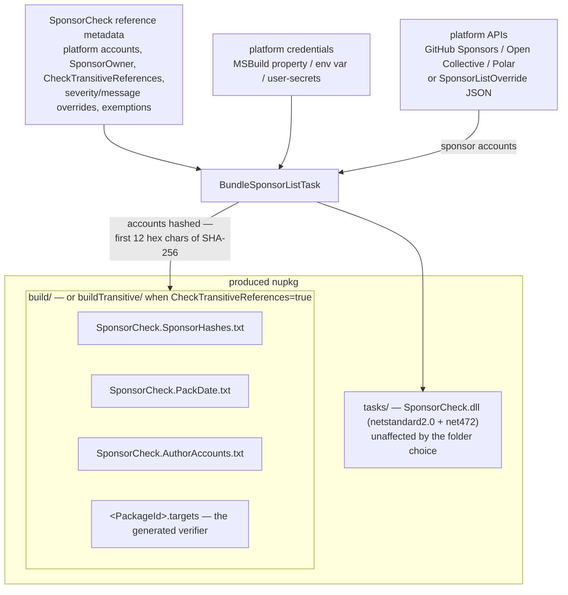

# OSS author setup

Add `SponsorCheck` as a `PrivateAssets="all"` development dependency on the library project, with one `<Platform>Account` metadatum per supported platform. The produced package acquires no runtime dependency on SponsorCheck — everything ships embedded (see [What gets bundled](#what-gets-bundled)). The [setup wizard](https://simoncropp.github.io/SponsorCheck/author) generates the reference, the credential setup, and consumer-facing release notes from a few questions.

<!-- snippet: ThePackage.csproj -->
<a id='snippet-ThePackage.csproj'></a>
```csproj
<Project Sdk="Microsoft.NET.Sdk">
  <PropertyGroup>
    <TargetFramework>netstandard2.0</TargetFramework>
  </PropertyGroup>
  <ItemGroup>
    <PackageReference Include="SponsorCheck" Version="$(SponsorCheckVersion)"
                      PrivateAssets="all"
                      GitHubSponsorsAccount="acmecorp"
                      OpenCollectiveAccount="acme-org"
                      PolarAccount="acme" />
  </ItemGroup>
</Project>
```
<sup><a href='/IntegrationTests/Fixtures/_Shared/ThePackage/ThePackage.csproj#L1-L12' title='Snippet source file'>snippet source</a> | <a href='#snippet-ThePackage.csproj' title='Start of snippet'>anchor</a></sup>
<!-- endSnippet -->


## Platforms

At least one `<Platform>Account` must be set. Credentials per platform:


### [GitHub Sponsors](https://github.com/open-source/sponsors)

 * MSBuild property: `<GitHubToken>`
 * Env var: `GitHubToken` (auto-imported into the MSBuild property of the same name)
 * User-secrets key: `SponsorCheck:GitHubToken`

Required - [classic PAT](https://github.com/settings/tokens/new) with `read:user`, plus `read:org` if sponsored as an organization. `read:user` is always required because the bundler reads per-sponsorship metadata (`isOneTimePayment`, `createdAt`, `isActive`) from `sponsorshipsAsMaintainer`, and GitHub gates those fields on `read:user` even when the maintainer is an organization. Fine-grained PATs don't expose a Sponsorships permission, so a classic PAT is the only option. The token must be owned by the sponsored account (or an admin of the sponsored org) — otherwise `sponsorshipsAsMaintainer` returns nothing and the bundled hash list will be empty. Private sponsors are never bundled regardless of the token ([Private and incognito sponsors](#private-and-incognito-sponsors)); the token still needs to see them so the pack log can report how many were excluded.

Some organizations disable classic-PAT access in their security settings. When sponsored as such an org, a classic PAT will fail with a `FORBIDDEN` error from GitHub at pack time and the bundler emits an actionable message. The org admin needs to re-enable classic-PAT access for the sponsored org. Because that arrives as `FORBIDDEN` rather than as a 401, it is reported separately from a credential the platform does not recognize at all ([SC107](BundlerDiagnosticCodes.md#sc107)) — the two have different fixes and neither message is emitted for the other case.


#### One-time sponsors

One-time GitHub sponsors are bundled for **one month from the payment date**. After that window the entry drops out of the next pack — the same behaviour a monthly sponsor gets after one billing cycle of non-renewal.

For this to map cleanly to "an effective month of sponsor status", set GitHub Sponsors' **"Set minimum amount"** (under [Sponsor profile → Tiers](https://github.com/sponsors)) to the **same value as the lowest monthly tier**. That way any one-time sponsorship is priced at least as much as a single month at the entry tier, so the one-month bundle window is paid for. If the minimum is lower than the monthly tier, one-time sponsors get the full month of sponsor status for less than the recurring sponsors pay — usually not the intent.

Recurring sponsors are bundled while their sponsorship is active and dropped as soon as it lapses, independent of this window.


### [OpenCollective](https://opencollective.com)

 * MSBuild property: `<OpenCollectiveToken>`
 * Env var: `OpenCollectiveToken` (auto-imported into the MSBuild property of the same name)
 * User-secrets key: `SponsorCheck:OpenCollectiveToken`

Optional - public collectives are queryable anonymously, but anonymous calls hit rate limits on collectives with many backers. Create a [Personal Token](https://opencollective.com/applications) (no scopes required — the token is used for rate-limit headroom, not access). A pack that exhausts the anonymous ceiling fails with [SC108](BundlerDiagnosticCodes.md#sc108), which recommends creating the token rather than advising a retry — paging a large member list will exhaust it again on the next run.


### [Polar](https://polar.sh)

 * MSBuild property: `<PolarToken>`
 * Env var: `PolarToken` (auto-imported into the MSBuild property of the same name)
 * User-secrets key: `SponsorCheck:PolarToken`

Required - [organization access token](https://docs.polar.sh/integrate/authentication/personal-access-token) with scopes `subscriptions:read`, `customers:read`, `organizations:read`. The customer scope matters: without it Polar can return null `github_username` / `email` on embedded customer objects, causing the bundler to fall back to opaque `user_id`s that won't match consumer-declared `<PolarSponsorAccount>` values.


## Token expiry and rejection

GitHub PATs and Polar API keys can both carry an expiry. A pack that suddenly fails with [SC107](BundlerDiagnosticCodes.md#sc107) means the platform no longer recognizes the stored credential — rotate it and update the secret. Pick "no expiration" on the GitHub PAT form for set-and-forget; otherwise add the rotation date to a calendar.

Expiry is not the only cause, and a token marked "no expiration" is not immune: deleting or regenerating a PAT invalidates the old value, and a CI secret store can go on holding a copy of a token that was replaced months ago. SC107 reports the credential's vendor prefix and length — never the value — and names the MSBuild property, env var, or user-secrets key it was read from, which is what identifies the store to correct when the same token name is configured in more than one place.

A rejection is not a permissions failure. A missing scope, a token an org has deauthorized under SAML, and an org that blocks classic PATs entirely all arrive as `FORBIDDEN` or `INSUFFICIENT_SCOPES` rather than as a 401, and each reports with its own message. SC107 specifically means the credential is unknown to the platform.


## Storing credentials

Precedence: explicit MSBuild property → env var (auto-imported by MSBuild) → user-secrets.


### Local dev — user-secrets

Recommended for local builds. [`dotnet user-secrets`](https://learn.microsoft.com/aspnet/core/security/app-secrets) stores tokens at `%APPDATA%\Microsoft\UserSecrets\<UserSecretsId>\secrets.json` (Windows) or `~/.microsoft/usersecrets/<id>/secrets.json` (Unix) — outside the repo, so there's no risk of accidentally committing the value. The bundler reads `SponsorCheck:<Platform>Token` keys.

Run from the directory containing the library's `.csproj`, or pass `--project <path>` explicitly — `dotnet user-secrets` resolves the project from the current directory and errors if it finds zero or multiple project files.

```pwsh
# writes <UserSecretsId> into the csproj in cwd
dotnet user-secrets init
dotnet user-secrets set "SponsorCheck:GitHubToken" "ghp_xxx"
dotnet user-secrets set "SponsorCheck:OpenCollectiveToken" "zzz"
dotnet user-secrets set "SponsorCheck:PolarToken" "polar_yyy"
```


### CI — encrypted env vars

Recommended for CI builds, where there's no per-developer profile to hold a user-secrets file. Encrypt the token in the CI provider's secret store (AppVeyor "secure variable", GitHub Actions secret, Azure DevOps secret variable, etc.) and surface it as an env var named `GitHubToken`, `OpenCollectiveToken`, or `PolarToken`. MSBuild auto-imports env vars as properties, so no extra wiring is needed — the bundler picks them up via the same `<GitHubToken>` / `<OpenCollectiveToken>` / `<PolarToken>` resolution path. The env var name must match the MSBuild property name modulo case (`GitHubToken`, `githubtoken`, and `GITHUBTOKEN` all resolve via case-insensitive property lookup), but punctuation matters — conventional CI names like `GITHUB_TOKEN` won't auto-flow.


### Pull request builds

Most CI providers withhold encrypted secrets from pull-request builds (especially PRs from forks), so the credential above isn't available — a pack there would otherwise fail with [SC102](BundlerDiagnosticCodes.md#sc102). A PR build also never publishes the package it produces, so the sponsorship verifier that bundling would embed is throwaway anyway.

So on a detected pull-request build the bundler is **skipped**: the package still packs — without the verifier — and no credential is required. A high-importance build message records that it happened. Detection covers the common providers via their PR-only signals — AppVeyor (`APPVEYOR_PULL_REQUEST_NUMBER`), GitHub Actions (`GITHUB_EVENT_NAME=pull_request`), Azure DevOps (`SYSTEM_PULLREQUEST_PULLREQUESTID`), GitLab, Bitbucket, Jenkins, Travis, CircleCI, Buildkite — and is deliberately conservative, so a real release build is never mistaken for a PR.

To validate the verifier on PR builds that *do* have the credential, opt back in:

```xml
<PropertyGroup>
  <SponsorCheckBundleInPullRequest>true</SponsorCheckBundleInPullRequest>
</PropertyGroup>
```


## Multiple packable projects in one repo

For repos that produce multiple NuGet packages, configure once and let MSBuild's normal cascading mechanisms apply:

```xml
<!-- Directory.Packages.props — sponsor accounts in one place -->
<PackageVersion Include="SponsorCheck" Version="0.1.0"
                GitHubSponsorsAccount="acmecorp"
                OpenCollectiveAccount="acme-org"
                PolarAccount="acme" />
```

```xml
<!-- Directory.Build.props — one UserSecretsId shared by every project so they all read the same secrets.json -->
<PropertyGroup>
  <UserSecretsId>acmecorp-monorepo-secrets</UserSecretsId>
</PropertyGroup>
```

Each csproj declares the bare reference:

```xml
<PackageReference Include="SponsorCheck" PrivateAssets="all" />
```

Each project still bundles independently at its own pack time (one platform fetch per packable project).


## Owner mode

When a family of packages is covered by sponsoring a single account, add `SponsorOwner` to the SponsorCheck reference to opt the produced package into **owner mode**. Consumers then configure sponsorship once via a global MSBuild property (see [Owner mode](ConsumerUsage.md#owner-mode) in the consumer guide) instead of per-package metadata — the natural shape for several libraries published under one GitHub org.

<!-- snippet: ThePackageOwnerMode.csproj -->
<a id='snippet-ThePackageOwnerMode.csproj'></a>
```csproj
<Project Sdk="Microsoft.NET.Sdk">
  <PropertyGroup>
    <TargetFramework>netstandard2.0</TargetFramework>
  </PropertyGroup>
  <ItemGroup>
    <!-- SponsorOwner opts this package into owner mode: consumers configure sponsorship once via
         global MSBuild properties rather than per-package metadata. -->
    <PackageReference Include="SponsorCheck" Version="$(SponsorCheckVersion)"
                      PrivateAssets="all"
                      GitHubSponsorsAccount="acmecorp"
                      OpenCollectiveAccount="acme-org"
                      PolarAccount="acme"
                      SponsorOwner="acme" />
  </ItemGroup>
</Project>
```
<sup><a href='/IntegrationTests/Fixtures/_Shared/ThePackageOwnerMode/ThePackageOwnerMode.csproj#L1-L15' title='Snippet source file'>snippet source</a> | <a href='#snippet-ThePackageOwnerMode.csproj' title='Start of snippet'>anchor</a></sup>
<!-- endSnippet -->

The `<Platform>Account` metadata is still required — the bundler fetches and bundles the sponsor list exactly as in per-package mode. `SponsorOwner` only changes the *consumer-side* verifier that gets bundled: it reads global MSBuild properties rather than `<PackageReference>` metadata, and de-duplicates so multiple owner-mode packages from the same owner verify once per build. The owner id is an opaque label — give every package in the family the same value. Owner-mode consumers see the [SC021–SC028](VerifierDiagnosticCodes.md#sc021) diagnostics; the severity/message overrides below apply to them too.


## Checking transitive references

By default the bundled verifier ships in the package's `build/` folder, which NuGet imports only for **direct** `<PackageReference>`s. A project that pulls the package in transitively — through another package that depends on it — is never checked. Setting `CheckTransitiveReferences="true"` on the SponsorCheck reference packs the verifier (and its sidecars) under `buildTransitive/` instead, so NuGet imports it for direct **and** transitive references:

```xml
<PackageReference Include="SponsorCheck" Version="$(SponsorCheckVersion)"
                  PrivateAssets="all"
                  GitHubSponsorsAccount="acmecorp"
                  CheckTransitiveReferences="true" />
```

A transitively-referenced consumer has no `<PackageReference>` of its own to carry a sponsor account, so an unconfigured one fails with the same [SC001](VerifierDiagnosticCodes.md#sc001) family as a direct consumer — the resolution is to add a direct reference declaring a license mode. Leaving the metadatum unset (or `false`) keeps the default: direct references only. The choice is the author's, baked into the produced nupkg at pack time.

Project references within the same solution are handled differently. If a project pulls the package in through a `<ProjectReference>` to a sibling project that has the direct `<PackageReference>`, the verifier in the downstream project skips — the direct consumer's verifier already produces the authoritative result, and emitting the diagnostic again in every dependent project would be noise. The check walks two levels of `<ProjectReference>` from each consumer, which covers the typical `App → Lib → Package` and `App → Web → Lib → Package` shapes. NuGet-transitive consumers (`Consumer → MiddlePackage → Package`) are *not* affected by this — they still verify under `CheckTransitiveReferences`, because the author's intent there is to enforce sponsorship across the package graph.


## Packages that ship their own MSBuild targets

NuGet auto-imports exactly one file named `<PackageId>.targets` into a consumer, and SponsorCheck claims that slot for the bundled verifier. A package that *also* ships its own `<PackageId>.targets` — for example to inject a source generator as an analyzer, register a build task, or set default properties — has both files wanting the same slot. SponsorCheck handles this automatically: at pack time it detects the author's own `<PackageId>.targets`, moves it aside to a `<PackageId>.SponsorCheckInner.targets` sidecar, and has the generated verifier `<Import>` that sidecar. The verifier owns the auto-import slot and the author's build logic still loads in consumers — no `NU5118` collision, no manual wiring:

```xml
<ItemGroup>
  <!-- The author's own build logic — packed to the <PackageId>.targets slot as usual. -->
  <None Include="build\MyOssLib.targets" Pack="true" PackagePath="build\MyOssLib.targets" />
  <None Include="build\MyOssLib.targets" Pack="true" PackagePath="buildTransitive\MyOssLib.targets" />

  <PackageReference Include="SponsorCheck" Version="$(SponsorCheckVersion)"
                    PrivateAssets="all"
                    GitHubSponsorsAccount="acmecorp"
                    CheckTransitiveReferences="true" />
</ItemGroup>
```

The `PackagePath` may name the file (as above) or only the folder (`PackagePath="buildTransitive\"`) — both are detected. When the file is shipped to both `build/` and `buildTransitive/` — so it loads for direct *and* transitive references — both copies are relocated and the verifier is packed into both folders, since NuGet imports `build/<PackageId>.targets` for a direct reference and `buildTransitive/<PackageId>.targets` for a transitive one. Leaving either folder to the author's file would mean those consumers get no verification at all. Both verifier copies carry identical target names, so a consumer importing both runs the check once.

This applies to `<PackageId>.targets` only; a shipped `<PackageId>.props` is untouched, since SponsorCheck never claims the props slot.


## Tuning verifier severity and message text

By default the verifier emits [`SC001`](VerifierDiagnosticCodes.md#sc001) (no license mode set), [`SC007`](VerifierDiagnosticCodes.md#sc007) (sponsor account not in list), and [`SC009`](VerifierDiagnosticCodes.md#sc009) (license expired) as **errors** that fail the consumer build, and [`SC005`](VerifierDiagnosticCodes.md#sc005) (license ignored) as a **warning**. An author who wants a softer nudge — or stricter enforcement, or a custom-worded message — can override the severity and/or the message text at pack time:

```xml
<PackageReference Include="SponsorCheck" Version="$(SponsorCheckVersion)"
                  PrivateAssets="all"
                  GitHubSponsorsAccount="acmecorp"
                  NoLicenseSpecifiedSeverityOverride="warning"
                  NoLicenseSpecifiedMessageOverride="Please sponsor MyOssLib before shipping."
                  LicenseIgnoredSeverityOverride="error" />
```

Available metadata (severity + message pair per overrideable code). Each override applies to **all** siblings of the same condition — one knob covers the non-CPM, CPM, and owner-mode codes:

| Codes | Severity metadata | Message metadata | Default severity |
| --- | --- | --- | --- |
| [SC001](VerifierDiagnosticCodes.md#sc001) / [SC002](VerifierDiagnosticCodes.md#sc002) / [SC021](VerifierDiagnosticCodes.md#sc021) | `NoLicenseSpecifiedSeverityOverride` | `NoLicenseSpecifiedMessageOverride` | error |
| [SC005](VerifierDiagnosticCodes.md#sc005) / [SC006](VerifierDiagnosticCodes.md#sc006) / [SC023](VerifierDiagnosticCodes.md#sc023) | `LicenseIgnoredSeverityOverride` | `LicenseIgnoredMessageOverride` | warning |
| [SC007](VerifierDiagnosticCodes.md#sc007) / [SC008](VerifierDiagnosticCodes.md#sc008) / [SC024](VerifierDiagnosticCodes.md#sc024) | `InvalidAccountSeverityOverride` | `InvalidAccountMessageOverride` | error |
| [SC009](VerifierDiagnosticCodes.md#sc009) / [SC010](VerifierDiagnosticCodes.md#sc010) / [SC025](VerifierDiagnosticCodes.md#sc025) | `LicenseExpiredSeverityOverride` | `LicenseExpiredMessageOverride` | error |

Severity values: `error`, `warning`, `message`. Message values: any string (the code's short Name still prefixes and the docs link still suffixes). Other codes are consumer-side configuration bugs and aren't overrideable. Unrecognized severity values fail the pack with [SC104](BundlerDiagnosticCodes.md#sc104). The chosen severities and messages are baked into the produced nupkg — consumers can't tamper with them.


## Defining exemptions

Many publishers have legitimate scenarios where a consumer doesn't need to sponsor — consulting clients, pre-existing customers, small businesses below a revenue threshold, etc. Treating those consumers as in breach of the package license (via the [SC005](VerifierDiagnosticCodes.md#sc005)-style warning that follows the build through CI) misrepresents the relationship.

`<SponsorExemption>` items declared next to the SponsorCheck reference let publishers define **named exemptions**, each with the criteria text that describes who qualifies. Consumers claim one by name (see [Publisher-defined exemptions](ConsumerUsage.md#publisher-defined-exemptions) in the consumer guide); the build passes with a warning whose body is the publisher's verbatim criteria text — so the consumer's audit trail documents the specific carve-out being claimed instead of a generic breach.

<!-- snippet: ThePackageWithExemptions.csproj -->
<a id='snippet-ThePackageWithExemptions.csproj'></a>
```csproj
<Project Sdk="Microsoft.NET.Sdk">
  <PropertyGroup>
    <TargetFramework>netstandard2.0</TargetFramework>
  </PropertyGroup>
  <ItemGroup>
    <PackageReference Include="SponsorCheck" Version="$(SponsorCheckVersion)"
                      PrivateAssets="all"
                      GitHubSponsorsAccount="acmecorp"
                      OpenCollectiveAccount="acme-org"
                      PolarAccount="acme" />
    <SponsorExemption Include="Consulting"
                      Message="Organizations that have engaged any of the core maintainers in consulting work could be exempt from the Maintenance Fee for 6 months from the final date of that work." />
    <SponsorExemption Include="SmallRevenue"
                      Message="Consumers under US$10,000 annual gross revenue are exempt." />
    <SponsorExemption Include="Evaluation"
                      Message="Teams evaluating the package before committing to a sponsorship are exempt while the evaluation is under way."
                      MaxTermMonths="3" />
  </ItemGroup>
</Project>
```
<sup><a href='/IntegrationTests/Fixtures/_Shared/ThePackageWithExemptions/ThePackageWithExemptions.csproj#L1-L19' title='Snippet source file'>snippet source</a> | <a href='#snippet-ThePackageWithExemptions.csproj' title='Start of snippet'>anchor</a></sup>
<!-- endSnippet -->

`Include=` is the exemption name consumers will claim; `Message=` is the criteria text that becomes the warning body. The bundler validates each item at pack time — empty name, empty message, or duplicate names (case-insensitive) fail with [SC106](BundlerDiagnosticCodes.md#sc106). The exemption set is baked into the produced nupkg under `build/SponsorCheck.Exemptions.json`, so consumers can't add new names or change the criteria text.

Exemption warnings ([SC029](VerifierDiagnosticCodes.md#sc029) / [SC030](VerifierDiagnosticCodes.md#sc030) / [SC031](VerifierDiagnosticCodes.md#sc031)) are **not** overrideable via `*MessageOverride` — the publisher's `Message` *is* the override. To change the warning text, edit the `Message` and repack.


### Time-bounding an exemption

Most exemptions describe a situation that ends: the consulting engagement wraps up, the evaluation concludes, the business grows past the revenue threshold. Nothing prompts a consumer to revisit a claim they made once, so an exemption declared in good faith quietly outlives the thing that justified it.

The optional `MaxTermMonths` metadatum makes a claim expire. Set it and the consumer must also declare `SponsorshipExemptionUntil="yyyy-MM"` — dated no more than that many months past their build clock — or the build fails with [SC038](VerifierDiagnosticCodes.md#sc038). Once that month ends, the build fails with [SC047](VerifierDiagnosticCodes.md#sc047) until they either renew the date (having re-checked that the exemption still applies) or move to another license mode. The `Evaluation` item in the snippet above is capped at three months.

The ceiling is measured from the build clock, so it rolls forward: a claim that was valid when written stays valid until it expires, and it is each *renewal* that gets re-capped. A value beyond the ceiling fails with [SC044](VerifierDiagnosticCodes.md#sc044) — without that, `9999-12` would satisfy the requirement and defeat it in the same line. `MaxTermMonths` must be a positive whole number; anything else fails the pack with [SC106](BundlerDiagnosticCodes.md#sc106) rather than silently degrading to an uncapped exemption.

Set the term from how long the underlying situation plausibly lasts, rather than from how often a re-confirmation seems desirable — a consumer re-attesting monthly to something that changes yearly stops reading the criteria. Leave `MaxTermMonths` unset for exemptions that genuinely don't expire (a permanent carve-out for a partner org, say); consumers can still bound those voluntarily, and the end date is enforced when they do.


## Custom sponsor landing URL

By default, the verifier surfaces each enabled platform's public sponsor page (e.g. `https://github.com/sponsors/acmecorp`, `https://opencollective.com/acme-org`, `https://polar.sh/acme`) wherever a sponsor URL appears in an `SC0xx` message — the per-platform `Option — Sponsor on ...` lines in [SC001](VerifierDiagnosticCodes.md#sc001)/[SC002](VerifierDiagnosticCodes.md#sc002)/[SC005](VerifierDiagnosticCodes.md#sc005)/[SC006](VerifierDiagnosticCodes.md#sc006) and the `Sponsor at ...` block in [SC007](VerifierDiagnosticCodes.md#sc007)/[SC008](VerifierDiagnosticCodes.md#sc008)/[SC009](VerifierDiagnosticCodes.md#sc009)/[SC010](VerifierDiagnosticCodes.md#sc010).

Authors who prefer to drive consumers to a single page they control — e.g. an author-owned "How to sponsor" landing page, an internal CRM, or a Stripe/Lemon Squeezy checkout — can set `SponsorLandingUrl` on the SponsorCheck reference. When set, every URL the verifier prints points at that page instead of the platform-native ones, and the multi-line `Sponsor at:` block collapses to a single `Sponsor at <landing-url>` line:

<!-- snippet: ThePackageLandingUrl.csproj -->
<a id='snippet-ThePackageLandingUrl.csproj'></a>
```csproj
<Project Sdk="Microsoft.NET.Sdk">
  <PropertyGroup>
    <TargetFramework>netstandard2.0</TargetFramework>
  </PropertyGroup>
  <ItemGroup>
    <PackageReference Include="SponsorCheck" Version="$(SponsorCheckVersion)"
                      PrivateAssets="all"
                      GitHubSponsorsAccount="acmecorp"
                      OpenCollectiveAccount="acme-org"
                      PolarAccount="acme"
                      SponsorLandingUrl="https://acme.example.com/sponsor" />
  </ItemGroup>
</Project>
```
<sup><a href='/IntegrationTests/Fixtures/_Shared/ThePackageLandingUrl/ThePackageLandingUrl.csproj#L1-L13' title='Snippet source file'>snippet source</a> | <a href='#snippet-ThePackageLandingUrl.csproj' title='Start of snippet'>anchor</a></sup>
<!-- endSnippet -->

The platform-specific `<Platform>Account` metadata is still required — the bundler uses it to fetch the actual sponsor list from each platform, and the consumer still declares a per-platform `<Platform>SponsorAccount` to match against the bundled hashes. Only the **rendered URLs** in diagnostic messages change; the hash-match logic, license-mode parsing, and platform fetch are unaffected. Like the severity/message overrides, the landing URL is baked into the produced nupkg at pack time — consumers can't tamper with it.


## Sponsor list override (testing & offline builds)

For testing or offline builds, set `<SponsorListOverride>` to a JSON file path:

<!-- snippet: sponsors-override.json -->
<a id='snippet-sponsors-override.json'></a>
```json
[
  { "platform": "GitHubSponsors", "account": "alice" },
  { "platform": "GitHubSponsors", "account": "bob" },
  { "platform": "OpenCollective", "account": "acme-org" },
  { "platform": "Polar",          "account": "acme" }
]
```
<sup><a href='/IntegrationTests/IntegrationTests/Fixtures/sponsors-override.json#L1-L6' title='Snippet source file'>snippet source</a> | <a href='#snippet-sponsors-override.json' title='Start of snippet'>anchor</a></sup>
<!-- endSnippet -->


## What gets bundled



The bundler runs at the OSS author's pack time (Release config, `IsPackable=true`). It:

1. Reads `<Platform>Account` metadata from the SponsorCheck `PackageReference` / `PackageVersion`.
1. For each enabled platform, calls the platform's API (or reads `SponsorListOverride` if set) to get the list of sponsor accounts.
1. Hashes each as the first 12 hex chars (48 bits) of `SHA256(utf8("{platform-id}:{lowercase(account)}"))`. Platform-id prefix prevents cross-platform spoofing.
1. Writes four files into the produced nupkg's `build/` folder: the sorted, deduped hashes (`SponsorCheck.SponsorHashes.txt`), the UTC pack date that powers the `SponsorshipStart` bypass (`SponsorCheck.PackDate.txt`), the enabled platform accounts used to render sponsor URLs in diagnostics (`SponsorCheck.AuthorAccounts.txt`), and the per-consumer verifier targets file (`<ThePackageId>.targets`). The verifier task DLL is packed under `tasks/`. When `SponsorOwner` is set, the generated targets are the owner-mode variant — they read global MSBuild properties instead of per-package metadata, with the owner id baked in. When `CheckTransitiveReferences` is set, those `build/` files ship under `buildTransitive/` instead, so NuGet imports the verifier for transitive consumers too (see [Checking transitive references](#checking-transitive-references)).


## Private and incognito sponsors

Both GitHub Sponsors and Open Collective let a supporter stay out of the public list, and SponsorCheck **never bundles either of them**:

| Platform | Mechanism | What the API returns |
| --- | --- | --- |
| GitHub Sponsors | Sponsor sets the sponsorship to private | The sponsorship carries `privacyLevel: PRIVATE`. Visible to the maintainer's own token, skipped by the bundler. |
| Open Collective | Contributor picks the **Incognito** profile | The member is attributed to a separate generated profile with `isIncognito: true` and a slug like `incognito-8f2a1c`. Skipped by the bundler. |
| Polar | — | No equivalent. Supporters are billing customers and there is no public list to opt out of. |

Excluding them is the point. The hash is [light obfuscation, not real privacy](#hashing--what-it-protects), and the file lands in every consumer's `~/.nuget/packages/` after restore — so a private sponsor's identity would ship, worldwide, behind a speed bump. Open Collective is worse still: the incognito slug is one the real backer has never seen, so bundling it publishes a hash *and* is unmatchable.

The pack log reports the count so the exclusion isn't silent:

```
GitHub Sponsors: 2 private sponsors are excluded from the bundled list. They cannot match a bundled hash, so they need SponsorshipPrivateUntil="yyyy-MM" alongside their sponsor account.
```

Never the accounts — the whole reason for excluding them is that those identities never leave the author's machine.

### What the sponsor does instead

They declare `SponsorshipPrivateUntil="yyyy-MM"` next to their platform account, and the verifier skips the hash check and logs an [SC059](VerifierDiagnosticCodes.md#sc059) audit message naming the account and the end month. See [Private and incognito sponsors](ConsumerUsage.md#private-and-incognito-sponsors) for the consumer side.

Nothing about the claim is verifiable — it is the same honour system as `SponsorshipLicenseIgnored`, minus the "in breach" framing, and it is not a weakening of enforcement: a consumer who wanted to free-ride already had `SponsorshipLicenseIgnored="true"`. What the end month adds is a forcing function. A private sponsorship that quietly lapses would otherwise ride along forever; instead the build fails with [SC056](VerifierDiagnosticCodes.md#sc056) and a person decides again.

### Capping the term

The claim is capped at **12 months** from the build clock by default. Narrow it with `PrivateSponsorMaxTermMonths` on the SponsorCheck reference:

```xml
<PackageReference Include="SponsorCheck"
                  Version="0.20.0"
                  PrivateAssets="all"
                  GitHubSponsorsAccount="acmecorp"
                  PrivateSponsorMaxTermMonths="6" />
```

A consumer naming a month beyond the cap fails with [SC053](VerifierDiagnosticCodes.md#sc053). The ceiling is measured from the build clock rather than from when the value was written, so it rolls forward with time — an already-valid claim keeps working, and only the re-attestation interval is bounded. A value that isn't a positive whole number fails the pack with [SC109](BundlerDiagnosticCodes.md#sc109).

The cap is baked into the generated verifier targets, so it applies from the next release onward; packages published before it existed keep the 12-month default.

There is no switch to disable the route entirely. Blocking it would add no enforcement — `SponsorshipLicenseIgnored="true"` is already the universal opt-out — while breaking the one honest path a paying private sponsor has.


## Hashing — what it protects

The hash is **light obfuscation, not real privacy.** Anyone with a wordlist of candidate usernames can reverse-engineer the published hashes by recomputing `SHA256("{platform-id}:{lowercase(login)}")` for each candidate and truncating to 12 hex chars. The hash isn't a security boundary either — `SponsorshipLicenseIgnored="true"` is the documented bypass, so anyone wanting to free-ride doesn't need to forge a match.

What hashing actually buys:

1. **Public sponsors aren't republished in bulk.** Every bundled account is one the sponsor already made public on the platform, so hashing protects nothing that isn't already visible — but the bundled list lands in every consumer's `~/.nuget/packages/<id>/<ver>/build/` after restore, which is a broader exposure than a page someone chose to publish. Hashing keeps the list from being grep-able across every consumer's disk. Sponsors who want real privacy use their platform's own privacy setting, and are [never bundled at all](#private-and-incognito-sponsors) — that, not the hash, is what protects them.
1. **Friction against casual scraping.** A flat list of usernames in a published nupkg is a free dataset for anyone running `nuget restore` on public CI. Hashing doesn't stop a determined deanonymizer but does stop incidental harvesting.

A sponsor who needs guarantees stronger than "annoying to reverse" — say they're sponsoring under a pseudonym they want kept separate from their GitHub identity — should make the sponsorship private on the platform. That keeps them out of the bundle entirely, and they use [`SponsorshipPrivateUntil`](#private-and-incognito-sponsors) to verify. The hash is a speed bump, not a wall, and it was never the right answer for that case.

Hash length is truncated to 48 bits (12 hex chars) because the only correctness requirement is "accidental collisions are implausible" — a non-sponsor's hash falsely matching the bundled list is ≈ 1 in tens of billions even at 100k sponsors. Preimage resistance is unnecessary given `SponsorshipLicenseIgnored`.


## Diagnostic codes

[Bundler diagnostic codes (SC1xx)](BundlerDiagnosticCodes.md) — every code the bundler can emit at pack time.
