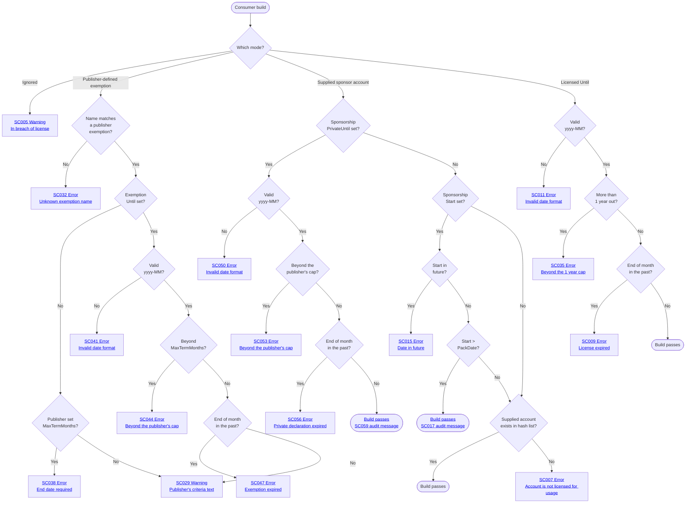

# Consumer usage

A package referenced by the build bundles the SponsorCheck verifier: on every build, in every configuration, it checks for a declared license mode and passes, warns, or fails with an [SC0xx code](VerifierDiagnosticCodes.md). This page is the full consumer reference. For the short version, start with the failing build message itself — it contains a copy-pasteable fix — or the [readme quick start](../readme.md#consumer-usage). The [setup wizard](https://simoncropp.github.io/SponsorCheck/consumer) asks a few questions and generates the exact snippet, the file to edit, and the expected outcome — given a package id, it inspects the published nupkg (client-side, from nuget.org) and pre-answers owner mode, the accepted platforms, and the defined exemptions.


## License modes

The license modes (sponsor account, time-bounded license, ignore) are mutually exclusive — pick exactly one. Where the declaration lives depends on how the package is configured:

- **Without CPM**, set the metadata on the consumer csproj's `<PackageReference>`.
- **With CPM** (`ManagePackageVersionsCentrally=true`), set it on the matching `<PackageVersion>` in `Directory.Packages.props`.
- **In [owner mode](#owner-mode)** (the author opted the package in), set the license mode as a global MSBuild property instead of per-package metadata — once, covering every package from that owner.

For the per-package modes, setting the metadata on the wrong element raises [wrong location - SC020](VerifierDiagnosticCodes.md#sc020) — the diagnostic message names the misplaced attribute(s) and the file they should move to. [set on both - SC019](VerifierDiagnosticCodes.md#sc019) is a defensive backstop for the rare case where [SC020](VerifierDiagnosticCodes.md#sc020)'s check is bypassed. (Owner mode reads a single property, so neither applies.)

Verifier diagnostics that prompt changes to consumer-side configuration ([SC001](VerifierDiagnosticCodes.md#sc001)/[SC002](VerifierDiagnosticCodes.md#sc002), [SC005](VerifierDiagnosticCodes.md#sc005)/[SC006](VerifierDiagnosticCodes.md#sc006), [SC007](VerifierDiagnosticCodes.md#sc007)/[SC008](VerifierDiagnosticCodes.md#sc008), [SC009](VerifierDiagnosticCodes.md#sc009)/[SC010](VerifierDiagnosticCodes.md#sc010), [SC011](VerifierDiagnosticCodes.md#sc011)/[SC012](VerifierDiagnosticCodes.md#sc012), [SC013](VerifierDiagnosticCodes.md#sc013)/[SC014](VerifierDiagnosticCodes.md#sc014), [SC015](VerifierDiagnosticCodes.md#sc015)/[SC016](VerifierDiagnosticCodes.md#sc016), [SC035](VerifierDiagnosticCodes.md#sc035)/[SC036](VerifierDiagnosticCodes.md#sc036)/[SC037](VerifierDiagnosticCodes.md#sc037), [SC050–SC058](VerifierDiagnosticCodes.md#sc050), and the owner-mode [SC021–SC028](VerifierDiagnosticCodes.md#sc021)) render a copy-pasteable snippet pre-filled with the package id, version, and the file to edit. Each odd/even pair is the non-CPM / CPM sibling of the same condition; SC021–SC028 are the owner-mode (global-property) equivalents, and codes from SC029 on run as non-CPM/CPM/owner triples instead.


## Sponsor account match (any platform)

<!-- snippet: Consumer.ValidGitHubSponsor.csproj -->
<a id='snippet-Consumer.ValidGitHubSponsor.csproj'></a>
```csproj
<Project Sdk="Microsoft.NET.Sdk">
  <PropertyGroup>
    <TargetFramework>net10.0</TargetFramework>
  </PropertyGroup>
  <ItemGroup>
    <PackageReference
      Include="ThePackage"
      Version="1.0.0"
      GitHubSponsorAccount="alice" />
  </ItemGroup>
</Project>
```
<sup><a href='/IntegrationTests/Fixtures/Consumer.ValidGitHubSponsor/Consumer.ValidGitHubSponsor.csproj#L1-L11' title='Snippet source file'>snippet source</a> | <a href='#snippet-Consumer.ValidGitHubSponsor.csproj' title='Start of snippet'>anchor</a></sup>
<!-- endSnippet -->

When the package author accepts multiple platforms and the consumer sponsors on one of them, supply the matching `<Platform>SponsorAccount` metadata. Multiple values are allowed — the verifier passes if **any** account matches the bundled list.


### Why multiple accounts are useful

A consumer organisation may sponsor different OSS authors across different platforms. Say `acmecorp` sponsors one library author on **GitHub Sponsors** and a different author on **Open Collective**. When packages from both authors land in the same consumer project, both `GitHubSponsorAccount="acmecorp"` and `OpenCollectiveSponsorAccount="acme-org"` need to be present so each package's bundled hash list finds its match. The verifier short-circuits on the first hit, so the cost is one cheap hash lookup per declared platform per package.

Without "any match" semantics the consumer would have to:

- Know in advance which platform each package's author publishes on.
- Track that mapping over time — an author switching platforms would break every consumer.
- Branch the metadata per package, likely via separate `<PackageReference>` items with conditional metadata.

Other reasons the same shape matters:

- **Sponsorship migration.** An author moving from GitHub Sponsors to Open Collective ships a new package version with the new hash list. Existing consumers who already have both attributes set keep building without a metadata change.
- **Personal vs org accounts.** A developer might sponsor as a personal GitHub handle for some authors and via their org's Open Collective for others. Both can sit side-by-side on the same `<PackageReference>` / `<PackageVersion>`.
- **Reduced churn in `Directory.Packages.props`.** In a monorepo, the consumer's sponsorship identities are set once at the top level. Every project that references a SponsorCheck-using package inherits all of them without per-project tuning.


### Recent sponsors: SponsorshipStart

The bundled hash list is frozen at the package's pack date. When sponsorship begins *after* the package was released, the account cannot possibly be in the list. Add `SponsorshipStart="yyyy-MM-dd"` to attest to the start date:

```xml
<PackageReference
  Include="ThePackage"
  Version="1.0"
  GitHubSponsorAccount="carol"
  SponsorshipStart="2026-04-30" />
```

If `SponsorshipStart` is **after** the package's pack date, the verifier trusts the declaration and emits a [trusted SponsorshipStart - SC017](VerifierDiagnosticCodes.md#sc017) high-priority build message naming the unverified sponsor (audit trail in the consumer's own build log). If `SponsorshipStart` is on or before the pack date (including equal — the boundary is strict), the hash check is enforced as normal: claiming to be a sponsor at release time means the account should already be in the bundled list.

`SponsorshipStart` in the future fails with [future SponsorshipStart - SC015](VerifierDiagnosticCodes.md#sc015). Once the OSS author ships a new version of ThePackage that includes the new sponsor in its hash list **and the consumer upgrades to it**, `SponsorshipStart` can be dropped. If the consumer stays on the older version, the attestation must remain.


### Private and incognito sponsors

A sponsorship that is **private** on GitHub Sponsors, or **incognito** on Open Collective, is deliberately never bundled into the hash list — so it can never match it, and a hash-only check fails with [no sponsor match - SC007](VerifierDiagnosticCodes.md#sc007) no matter how correct the account is. (See [the author-side rationale](AuthorSetup.md#private-and-incognito-sponsors) for why the accounts are excluded rather than hashed. Polar has no equivalent: supporters there are billing customers, not a public list.)

Declare `SponsorshipPrivateUntil="yyyy-MM"` alongside the account instead:

```xml
<PackageReference
  Include="ThePackage"
  Version="1.0"
  GitHubSponsorAccount="octocat"
  SponsorshipPrivateUntil="2027-05" />
```

The verifier skips the hash check and emits a [trusted private sponsorship - SC059](VerifierDiagnosticCodes.md#sc059) high-priority build message naming the account and the end month — an audit trail in the consumer's own build log, not a warning, so a paying sponsor isn't nagged on every build. In [owner mode](#owner-mode) it is the `{owner}_SponsorshipPrivateUntil` property, exactly like the other modes.

The month is capped at **12 months** from the build clock unless the publisher narrowed it; beyond that fails with [SC053](VerifierDiagnosticCodes.md#sc053), and a value that isn't `yyyy-MM` fails with [SC050](VerifierDiagnosticCodes.md#sc050). The named month is covered through its final instant; after that the build fails with [expired private sponsorship - SC056](VerifierDiagnosticCodes.md#sc056) until the month is renewed or another mode is chosen.

That expiry is the whole mechanism. Nothing about a private sponsorship is checkable against the bundled list, so unlike `SponsorshipStart` — which self-expires when a newer pack date overtakes it — a private declaration would otherwise never be re-examined. The end month converts it into a decision a person makes every few months.

Setting it alone does nothing: like `SponsorshipStart` and `SponsorshipExemptionUntil`, it qualifies a sponsor claim rather than being one, so it still needs a `<Platform>SponsorAccount` next to it. If both `SponsorshipPrivateUntil` and `SponsorshipStart` are set, the private declaration decides the build — an expired one fails rather than falling back to the start-date path.

> **Not the same as `SponsorshipLicensedUntil`.** Both take a `yyyy-MM` month, and the docs call `SponsorshipLicensedUntil` the [time-bounded *private* license](#time-bounded-private-license) — but that is a licensing arrangement made directly with the author, with no platform sponsorship behind it. `SponsorshipPrivateUntil` says the opposite: there *is* a real platform sponsorship, and it is not public. The sibling attribute tells them apart — a platform account means the private-sponsorship route.


## Sponsor account match (owner mode)

When the author opted the package into [owner mode](#owner-mode), the same sponsor-account match is declared once as a global MSBuild property rather than `<PackageReference>` metadata. The property names are **scoped by the package's owner id** — `{owner}_GitHubSponsorAccount`, `{owner}_OpenCollectiveSponsorAccount`, `{owner}_PolarSponsorAccount` — so a consumer of packages from two different owners can configure each one independently (e.g. sponsor `acme` from a personal handle and `papyrine-corp` from an org). The owner id is baked into the package at pack time and is part of the SC021 error message, so there is no guessing about what to type:

<!-- snippet: Consumer.OwnerCsprojProperty.csproj -->
<a id='snippet-Consumer.OwnerCsprojProperty.csproj'></a>
```csproj
<Project Sdk="Microsoft.NET.Sdk">
  <PropertyGroup>
    <TargetFramework>net10.0</TargetFramework>
    <!-- Owner mode: sponsorship configured as a global MSBuild property, here directly in the csproj. -->
    <acme_GitHubSponsorAccount>alice</acme_GitHubSponsorAccount>
  </PropertyGroup>
  <ItemGroup>
    <PackageReference Include="ThePackageOwnerMode" Version="1.0.0" />
  </ItemGroup>
</Project>
```
<sup><a href='/IntegrationTests/Fixtures/Consumer.OwnerCsprojProperty/Consumer.OwnerCsprojProperty.csproj#L1-L10' title='Snippet source file'>snippet source</a> | <a href='#snippet-Consumer.OwnerCsprojProperty.csproj' title='Start of snippet'>anchor</a></sup>
<!-- endSnippet -->

The property can sit in the consuming csproj (above) or once in `Directory.Build.props` to cover every owner-mode package under that directory. The any-match rule is unchanged: declare one property per platform the consumer sponsors on, and the verifier passes if any matches the bundled list. `SponsorshipStart` works identically as a property for sponsors who joined after the pack date. Owner-mode builds surface the [SC021–SC028](VerifierDiagnosticCodes.md#sc021) diagnostics in place of their per-package siblings — see [Owner mode](#owner-mode) for how a family of packages from one owner de-duplicates to a single check and how a package migrates into or out of owner mode.


## Sponsorship lifecycle: what happens after sponsorship lapses

The bundled hash list is frozen per package version. The verifier has no notion of "currently sponsoring" — it only checks whether the consumer's account hash was in the list at pack time, or whether the consumer has attested to a `SponsorshipStart` after that pack date. That has three practical consequences when sponsorship lapses:

1. **Already-bundled versions stay buildable forever.** If the consumer's account hash was bundled into v1.1 at the time it was packed, the verifier keeps accepting it for v1.1 builds even after the consumer stops sponsoring. Versions paid for stay paid for; the OSS author has no recall mechanism short of yanking the package.
2. **Newer versions packed after a lapse reject the consumer.** If the author ships v1.2 after the consumer stops, the consumer's hash is not in v1.2's bundled list and a hash-only check fails with [no sponsor match - SC007](VerifierDiagnosticCodes.md#sc007). To upgrade, the consumer must either re-sponsor (so the hash lands in the next pack), switch the package to `SponsorshipLicensedUntil="yyyy-MM"`, or opt out with `SponsorshipLicenseIgnored="true"` (which emits the [license ignored - SC005](VerifierDiagnosticCodes.md#sc005) warning on every build). A current sponsor can also land here without having lapsed at all — a [private or incognito sponsorship](#private-and-incognito-sponsors) is never bundled, and needs `SponsorshipPrivateUntil` rather than a re-sponsor.
3. **`SponsorshipStart` is honor-system but self-expiring.** The verifier cannot tell whether the consumer is currently sponsoring; it only checks that the attested start date is `> PackDate` and `<= today`. While the consumer stays on the package version where the attestation was added, leaving it in after a lapse keeps the build passing — same shape as bullet 1 (paid versions stay paid). On upgrade, the newer `PackDate` overtakes the attested start, the bypass stops firing, and bullet 2 takes over (lapsed sponsors fail with [no sponsor match - SC007](VerifierDiagnosticCodes.md#sc007)). So `SponsorshipStart` doesn't need to be cleaned up proactively — leaving it in place is harmless. The only audit signal while the bypass is active is the [trusted SponsorshipStart - SC017](VerifierDiagnosticCodes.md#sc017) message in the consumer's own build log; the OSS author never sees it.


## Time-bounded private license

<!-- snippet: Consumer.FutureLicense.csproj -->
<a id='snippet-Consumer.FutureLicense.csproj'></a>
```csproj
<Project Sdk="Microsoft.NET.Sdk">
  <PropertyGroup>
    <TargetFramework>net10.0</TargetFramework>
  </PropertyGroup>
  <ItemGroup>
    <!-- Normally a literal month, e.g. SponsorshipLicensedUntil="2027-06". Computed here so this
         fixture stays inside the 1-year cap no matter when the test suite runs. -->
    <PackageReference
      Include="ThePackage"
      Version="1.0.0"
      SponsorshipLicensedUntil="$([System.DateTime]::UtcNow.AddMonths(6).ToString('yyyy-MM'))" />
  </ItemGroup>
</Project>
```
<sup><a href='/IntegrationTests/Fixtures/Consumer.FutureLicense/Consumer.FutureLicense.csproj#L1-L13' title='Snippet source file'>snippet source</a> | <a href='#snippet-Consumer.FutureLicense.csproj' title='Start of snippet'>anchor</a></sup>
<!-- endSnippet -->

For private B2B licensing arrangements outside of the platforms. Format is `yyyy-MM`; the license is valid through the end of that month UTC.

The value is capped at one year from the build clock — the same calendar month next year is the latest accepted value, and anything beyond it fails with [SC035](VerifierDiagnosticCodes.md#sc035) (CPM: [SC036](VerifierDiagnosticCodes.md#sc036), owner mode: [SC037](VerifierDiagnosticCodes.md#sc037)). Nothing verifies the declaration, so without a ceiling `SponsorshipLicensedUntil="9999-12"` would be a permanent opt-out wearing a license's clothes. Capping it means a lapsed arrangement surfaces within a year, and renewing is a one-line edit.

In [owner mode](#owner-mode) the same license is declared once as a global `{owner}_SponsorshipLicensedUntil` property — in the consuming csproj or in `Directory.Build.props` — rather than `<PackageReference>` metadata:

<!-- snippet: Consumer.OwnerFutureLicense.csproj -->
<a id='snippet-Consumer.OwnerFutureLicense.csproj'></a>
```csproj
<Project Sdk="Microsoft.NET.Sdk">
  <PropertyGroup>
    <TargetFramework>net10.0</TargetFramework>
    <!-- Owner mode: a time-bounded private license configured as a global MSBuild property. Normally
         a literal month, e.g. 2027-06; computed here so this fixture stays inside the 1-year cap no
         matter when the test suite runs. -->
    <acme_SponsorshipLicensedUntil>$([System.DateTime]::UtcNow.AddMonths(6).ToString('yyyy-MM'))</acme_SponsorshipLicensedUntil>
  </PropertyGroup>
  <ItemGroup>
    <PackageReference Include="ThePackageOwnerMode" Version="1.0.0" />
  </ItemGroup>
</Project>
```
<sup><a href='/IntegrationTests/Fixtures/Consumer.OwnerFutureLicense/Consumer.OwnerFutureLicense.csproj#L1-L12' title='Snippet source file'>snippet source</a> | <a href='#snippet-Consumer.OwnerFutureLicense.csproj' title='Start of snippet'>anchor</a></sup>
<!-- endSnippet -->

An expired value fails with [SC025](VerifierDiagnosticCodes.md#sc025), the owner-mode counterpart of the per-package [SC009](VerifierDiagnosticCodes.md#sc009)/[SC010](VerifierDiagnosticCodes.md#sc010).


## Explicit ignore

An escape hatch to disable licensing.

<!-- snippet: Consumer.IgnoredLicense.csproj -->
<a id='snippet-Consumer.IgnoredLicense.csproj'></a>
```csproj
<Project Sdk="Microsoft.NET.Sdk">
  <PropertyGroup>
    <TargetFramework>net10.0</TargetFramework>
  </PropertyGroup>
  <ItemGroup>
    <PackageReference
      Include="ThePackage"
      Version="1.0.0"
      SponsorshipLicenseIgnored="true" />
  </ItemGroup>
</Project>
```
<sup><a href='/IntegrationTests/Fixtures/Consumer.IgnoredLicense/Consumer.IgnoredLicense.csproj#L1-L11' title='Snippet source file'>snippet source</a> | <a href='#snippet-Consumer.IgnoredLicense.csproj' title='Start of snippet'>anchor</a></sup>
<!-- endSnippet -->

Build passes but emits the [license ignored - SC005](VerifierDiagnosticCodes.md#sc005) warning on every build, flagging that the build is in breach of the package's license.


## Publisher-defined exemptions

`SponsorshipLicenseIgnored` is the universal opt-out, but the warning frames the consumer as in breach. Many publishers carve out scenarios where consumption is *legitimately* free — pre-existing customers, consulting clients, small businesses below a revenue threshold, etc. Those consumers shouldn't ship a "breach of license" warning through CI for the lifetime of every build.

Publishers can define named **exemptions** at pack time (see [Defining exemptions](AuthorSetup.md#defining-exemptions) in the author guide). Consumers claim one by name; the build passes with a warning whose body is the publisher's own criteria text — so CI logs and code review show the exact exemption being claimed instead of a generic breach message.

<!-- snippet: Consumer.Exemption.csproj -->
<a id='snippet-Consumer.Exemption.csproj'></a>
```csproj
<Project Sdk="Microsoft.NET.Sdk">
  <PropertyGroup>
    <TargetFramework>net10.0</TargetFramework>
  </PropertyGroup>
  <ItemGroup>
    <PackageReference
      Include="ThePackageWithExemptions"
      Version="1.0.0"
      SponsorshipExemption="Consulting" />
  </ItemGroup>
</Project>
```
<sup><a href='/IntegrationTests/Fixtures/Consumer.Exemption/Consumer.Exemption.csproj#L1-L11' title='Snippet source file'>snippet source</a> | <a href='#snippet-Consumer.Exemption.csproj' title='Start of snippet'>anchor</a></sup>
<!-- endSnippet -->

Under CPM (Central Package Management), the metadata moves to `<PackageVersion>` in `Directory.Packages.props`:

<!-- snippet: Consumer.CpmExemption.Directory.Packages.props -->
<a id='snippet-Consumer.CpmExemption.Directory.Packages.props'></a>
```props
<PropertyGroup>
  <ManagePackageVersionsCentrally>true</ManagePackageVersionsCentrally>
</PropertyGroup>
<ItemGroup>
  <PackageVersion Include="ThePackageWithExemptions" Version="1.0.0"
                  SponsorshipExemption="SmallRevenue" />
</ItemGroup>
```
<sup><a href='/IntegrationTests/Fixtures/Consumer.CpmExemption/Directory.Packages.props#L2-L10' title='Snippet source file'>snippet source</a> | <a href='#snippet-Consumer.CpmExemption.Directory.Packages.props' title='Start of snippet'>anchor</a></sup>
<!-- endSnippet -->

In owner mode, the property uses the owner prefix:

<!-- snippet: Consumer.OwnerExemption.csproj -->
<a id='snippet-Consumer.OwnerExemption.csproj'></a>
```csproj
<Project Sdk="Microsoft.NET.Sdk">
  <PropertyGroup>
    <TargetFramework>net10.0</TargetFramework>
    <!-- Owner-mode opt-in via the owner-prefixed global property. -->
    <acme_SponsorshipExemption>Consulting</acme_SponsorshipExemption>
  </PropertyGroup>
  <ItemGroup>
    <PackageReference Include="ThePackageOwnerModeWithExemptions" Version="1.0.0" />
  </ItemGroup>
</Project>
```
<sup><a href='/IntegrationTests/Fixtures/Consumer.OwnerExemption/Consumer.OwnerExemption.csproj#L1-L10' title='Snippet source file'>snippet source</a> | <a href='#snippet-Consumer.OwnerExemption.csproj' title='Start of snippet'>anchor</a></sup>
<!-- endSnippet -->

Build passes with a warning ([SC029](VerifierDiagnosticCodes.md#sc029) / [SC030](VerifierDiagnosticCodes.md#sc030) / [SC031](VerifierDiagnosticCodes.md#sc031) for non-CPM / CPM / owner mode) whose body is the publisher's criteria text verbatim. Naming an exemption the publisher did not define fails the build with [SC032](VerifierDiagnosticCodes.md#sc032) / [SC033](VerifierDiagnosticCodes.md#sc033) / [SC034](VerifierDiagnosticCodes.md#sc034); the error body lists the available exemptions so the consumer can correct.

Lookup is case-insensitive but the warning text echoes the consumer-typed casing — what's in the audit trail is exactly what the consumer wrote.


### Time-bounded exemptions

Publishers can mark an exemption as expiring — usually because the situation it describes does (a consulting engagement finishes, an evaluation concludes, a business grows past a revenue threshold). Claiming one requires a second attribute, `SponsorshipExemptionUntil`, in the same `yyyy-MM` format as `SponsorshipLicensedUntil` and covering that whole month:

```xml
<PackageReference
  Include="ThePackageWithExemptions"
  Version="1.0.0"
  SponsorshipExemption="Evaluation"
  SponsorshipExemptionUntil="2027-02" />
```

Under CPM both attributes go on the `<PackageVersion>`; in owner mode both are owner-prefixed properties (`<acme_SponsorshipExemption>` and `<acme_SponsorshipExemptionUntil>`). Splitting them across elements raises [wrong location - SC020](VerifierDiagnosticCodes.md#sc020) like any other SponsorCheck metadata.

What the verifier does with the value:

| Situation | Result |
| --- | --- |
| Publisher time-bounds the exemption, no end month supplied | [end date required - SC038](VerifierDiagnosticCodes.md#sc038) |
| Value isn't a `yyyy-MM` month | [invalid format - SC041](VerifierDiagnosticCodes.md#sc041) |
| Month is further out than the publisher's cap | [beyond the cap - SC044](VerifierDiagnosticCodes.md#sc044) — the error names the latest month allowed |
| Month has passed | [exemption expired - SC047](VerifierDiagnosticCodes.md#sc047) |
| Otherwise | Build passes with the usual [SC029](VerifierDiagnosticCodes.md#sc029) warning, which now also names the end month |

The cap is measured from the build clock, so a claim that was in range when written stays in range until it expires — it's each renewal that gets re-capped. Once the month passes the build fails, which is the point: it prompts someone to confirm the carve-out still applies before extending it. If it no longer does, switch to one of the other license modes.

`SponsorshipExemptionUntil` is accepted on exemptions the publisher did *not* time-bound, too. Nothing requires it there, but a date supplied voluntarily is enforced the same way — a useful self-imposed reminder for a claim expected to be temporary.


## Owner mode

By default each package is configured independently — the license mode lives on that package's `<PackageReference>` (or `<PackageVersion>`). When an author ships a family of packages covered by a single sponsor account (e.g. several libraries under one GitHub org), they can opt into **owner mode** so consumers configure sponsorship **once**, as a global MSBuild property that covers every package from that owner.

The same license modes apply (sponsor account, time-bounded license, ignore) but are set as plain properties rather than per-package metadata — directly in a consuming project (the [snippet above](#sponsor-account-match-owner-mode)), or once in `Directory.Build.props`, so it applies to every project under that directory (the natural fit for a monorepo or solution):

```xml
<Project>
  <PropertyGroup>
    <acme_GitHubSponsorAccount>alice</acme_GitHubSponsorAccount>
  </PropertyGroup>
</Project>
```

Property names are the per-package metadata names prefixed with `{owner}_`: `{owner}_GitHubSponsorAccount`, `{owner}_OpenCollectiveSponsorAccount`, `{owner}_PolarSponsorAccount`, `{owner}_SponsorshipLicensedUntil`, `{owner}_SponsorshipLicenseIgnored`, and `{owner}_SponsorshipStart`. The prefix keeps each owner's settings separate when a consumer references owner-mode packages from multiple authors. Owner-mode builds emit the [SC021–SC028](VerifierDiagnosticCodes.md#sc021) family — the single-source equivalents of the per-package [SC001–SC016](VerifierDiagnosticCodes.md#sc001) codes (e.g. [SC021](VerifierDiagnosticCodes.md#sc021) is the owner-mode "no license specified", [SC024](VerifierDiagnosticCodes.md#sc024) the "account not in list"). Whether a package uses owner mode is decided by the author at pack time; a consumer can't switch a per-package package into owner mode or vice versa.


### Migrating to or from owner mode

The mode is fixed per package version at pack time, so it can change on upgrade — a version published in per-package mode reads the `<PackageReference>` / `<PackageVersion>` metadata, while a version published in owner mode reads the global property. The two are independent MSBuild sources, so neither reads the other.

A flip never mis-verifies silently: if sponsorship is declared in the place the new version doesn't read, the build fails with a clear code — [SC021](VerifierDiagnosticCodes.md#sc021) when a package moves *into* owner mode (set the property), or [SC001](VerifierDiagnosticCodes.md#sc001)/[SC002](VerifierDiagnosticCodes.md#sc002) when it moves *out* (set the metadata).

Because the two sources don't interfere, a consumer can ride out the transition with **zero failed builds** by declaring sponsorship in *both* places at once:

```xml
<!-- Directory.Build.props — read by owner-mode packages whose SponsorOwner is "acme" -->
<PropertyGroup>
  <acme_GitHubSponsorAccount>alice</acme_GitHubSponsorAccount>
</PropertyGroup>
```

```xml
<!-- the consuming csproj (or Directory.Packages.props under CPM) — read by per-package packages -->
<PackageReference Include="ThePackage" Version="1.1.0" GitHubSponsorAccount="alice" />
```

Owner-mode packages read the property and per-package packages read the metadata, with no conflict — so a mixed fleet, where some referenced versions have flipped and some haven't, all builds cleanly. Once every referenced package is on the same mode, the now-unused declaration can be dropped.


## How verification works

The verifier runs in consumer projects on every build and:

1. Locates the consumer's `PackageReference` and `PackageVersion` for ThePackage by id.
1. Merges metadata across both. Reads license-mode declarations (`SponsorshipLicenseIgnored`, `SponsorshipLicensedUntil`, `<Platform>SponsorAccount`).
1. Applies the appropriate decision: ignored (warn), sponsor (check hash list), license (check expiry), or fail with the relevant SC code.

In owner mode the same decision logic runs, but the declarations are read from global MSBuild properties (set once in `Directory.Build.props` or a consuming csproj) rather than per-package metadata, and the [SC021–SC028](VerifierDiagnosticCodes.md#sc021) codes are emitted in place of their per-package siblings.

<!-- include: verifier-flow. path: /docs/verifier-flow.include.md -->


> The decision logic above is identical across all three placements; only the emitted code differs. Terminal codes shown are the non-CPM (`<PackageReference>`) variants. A CPM consumer (`<PackageVersion>` in `Directory.Packages.props`) emits the `+1` sibling of each ([SC005](https://github.com/SimonCropp/SponsorCheck/blob/main/docs/VerifierDiagnosticCodes.md#sc005)→[SC006](https://github.com/SimonCropp/SponsorCheck/blob/main/docs/VerifierDiagnosticCodes.md#sc006), [SC007](https://github.com/SimonCropp/SponsorCheck/blob/main/docs/VerifierDiagnosticCodes.md#sc007)→[SC008](https://github.com/SimonCropp/SponsorCheck/blob/main/docs/VerifierDiagnosticCodes.md#sc008), [SC029](https://github.com/SimonCropp/SponsorCheck/blob/main/docs/VerifierDiagnosticCodes.md#sc029)→[SC030](https://github.com/SimonCropp/SponsorCheck/blob/main/docs/VerifierDiagnosticCodes.md#sc030), [SC032](https://github.com/SimonCropp/SponsorCheck/blob/main/docs/VerifierDiagnosticCodes.md#sc032)→[SC033](https://github.com/SimonCropp/SponsorCheck/blob/main/docs/VerifierDiagnosticCodes.md#sc033), [SC035](https://github.com/SimonCropp/SponsorCheck/blob/main/docs/VerifierDiagnosticCodes.md#sc035)→[SC036](https://github.com/SimonCropp/SponsorCheck/blob/main/docs/VerifierDiagnosticCodes.md#sc036), …). An [owner-mode](https://github.com/SimonCropp/SponsorCheck/blob/main/docs/VerifierDiagnosticCodes.md#sc021) consumer (sponsorship set via a global MSBuild property) emits the SC021–SC028 equivalent for the original modes (Ignored→[SC023](https://github.com/SimonCropp/SponsorCheck/blob/main/docs/VerifierDiagnosticCodes.md#sc023), no match→[SC024](https://github.com/SimonCropp/SponsorCheck/blob/main/docs/VerifierDiagnosticCodes.md#sc024), expired→[SC025](https://github.com/SimonCropp/SponsorCheck/blob/main/docs/VerifierDiagnosticCodes.md#sc025), invalid date→[SC026](https://github.com/SimonCropp/SponsorCheck/blob/main/docs/VerifierDiagnosticCodes.md#sc026), future start→[SC028](https://github.com/SimonCropp/SponsorCheck/blob/main/docs/VerifierDiagnosticCodes.md#sc028)) plus the third code of each SC029-onward triple for the exemption and private-sponsorship branches ([SC031](https://github.com/SimonCropp/SponsorCheck/blob/main/docs/VerifierDiagnosticCodes.md#sc031), [SC034](https://github.com/SimonCropp/SponsorCheck/blob/main/docs/VerifierDiagnosticCodes.md#sc034), [SC040](https://github.com/SimonCropp/SponsorCheck/blob/main/docs/VerifierDiagnosticCodes.md#sc040), [SC043](https://github.com/SimonCropp/SponsorCheck/blob/main/docs/VerifierDiagnosticCodes.md#sc043), [SC046](https://github.com/SimonCropp/SponsorCheck/blob/main/docs/VerifierDiagnosticCodes.md#sc046), [SC049](https://github.com/SimonCropp/SponsorCheck/blob/main/docs/VerifierDiagnosticCodes.md#sc049), [SC052](https://github.com/SimonCropp/SponsorCheck/blob/main/docs/VerifierDiagnosticCodes.md#sc052), [SC055](https://github.com/SimonCropp/SponsorCheck/blob/main/docs/VerifierDiagnosticCodes.md#sc055), [SC058](https://github.com/SimonCropp/SponsorCheck/blob/main/docs/VerifierDiagnosticCodes.md#sc058)) and [SC037](https://github.com/SimonCropp/SponsorCheck/blob/main/docs/VerifierDiagnosticCodes.md#sc037) for the one-year cap; [SC017](https://github.com/SimonCropp/SponsorCheck/blob/main/docs/VerifierDiagnosticCodes.md#sc017) and [SC059](https://github.com/SimonCropp/SponsorCheck/blob/main/docs/VerifierDiagnosticCodes.md#sc059) are shared. The exemption branch only fires when the publisher defined `<SponsorExemption>` items at pack time — packages without any exemptions never reach `KnownName`. The `MaxTermMonths` sub-branch only fires for exemptions the publisher time-bounded; an uncapped one goes straight from `KnownName` to `SC029`, unless the consumer bound it themselves, in which case `UntilExpired` still applies. The private-sponsorship branch is checked ahead of `SponsorshipStart` because a valid declaration decides the build outright — a private or incognito sponsorship is never in the hash list regardless of when it began.
<!-- endInclude -->


## Diagnostic codes

[Verifier diagnostic codes (SC0xx)](VerifierDiagnosticCodes.md) — every code the verifier can emit, with syntax, examples, and remediation.
