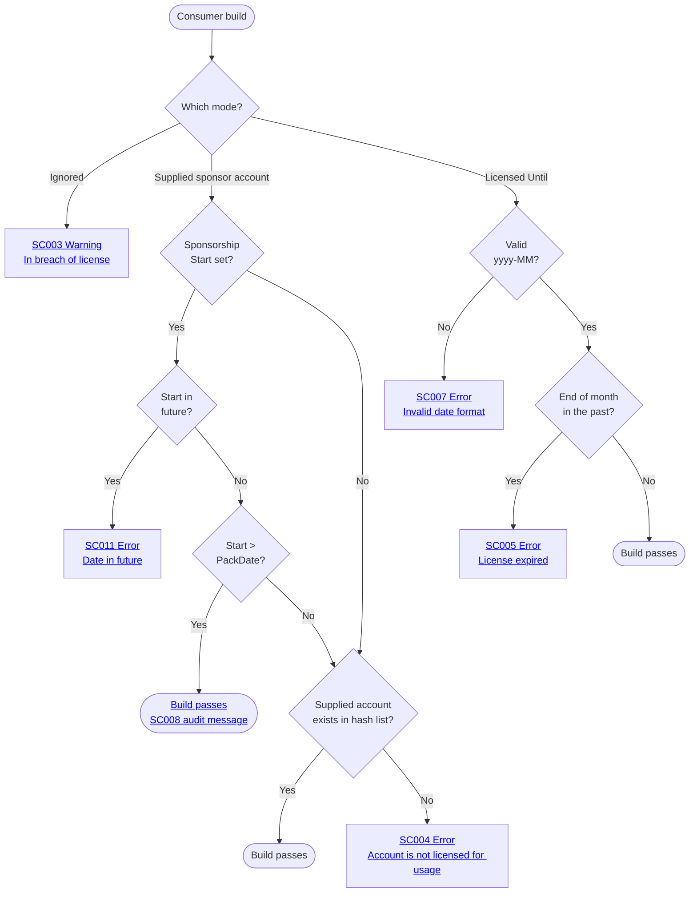

# Verifier diagnostic codes

Codes in the `SC0xx` range are emitted by the verifier in consumer projects.

Every emitted message is prefixed with the code's short **Name** (e.g. `No license specified. Package 'MyOssLib'...`) and suffixed with ` See: https://github.com/SimonCropp/SponsorCheck/blob/main/docs/VerifierDiagnosticCodes.md#<code>`. The Syntax/Example entries below show the inner format string only — the name and link wrap is added at log time.

The default severities below can be overridden by the OSS author at pack time with one named metadatum per code on their `<PackageReference Include="SponsorCheck">`: `NoLicenseSpecifiedSeverityOverride` (SC001), `LicenseIgnoredSeverityOverride` (SC003), `InvalidAccountSeverityOverride` (SC004), `LicenseExpiredSeverityOverride` (SC005). Other codes are consumer-side configuration bugs that the consumer must fix and so cannot be downgraded. Allowed values are `error`, `warning`, `message`.

<!-- include: verifier-flow. path: /docs/verifier-flow.include.md -->

<!-- endInclude -->

### SC001

- **Name:** No license specified
- **Level**: Error
- **Meaning:** No license mode set on the PackageReference / PackageVersion.
- **Syntax:** `Package '{PackageId}' is built with SponsorCheck and requires one license-mode metadata: SponsorshipLicenseIgnored="true", a <Platform>SponsorAccount, or SponsorshipLicensedUntil="yyyy-MM". Sponsor at: {sponsorUrls}.`
- **Example:** `Package 'MyOssLib' is built with SponsorCheck and requires one license-mode metadata: SponsorshipLicenseIgnored="true", a <Platform>SponsorAccount, or SponsorshipLicensedUntil="yyyy-MM". Sponsor at: https://github.com/sponsors/acmecorp.`

### SC002

- **Name:** Conflicting license modes
- **Level**: Error
- **Meaning:** Multiple license modes set (mutually exclusive).
- **Syntax:** `Package '{PackageId}': mutually exclusive license modes set ({modes}). Pick one.`
- **Example:** `Package 'MyOssLib': mutually exclusive license modes set (SponsorshipLicenseIgnored, Sponsor). Pick one.`

### SC003

- **Name:** License ignored
- **Level**: Warning
- **Meaning:** `SponsorshipLicenseIgnored="true"` — consumer has opted out.
- **Syntax:** `Package '{PackageId}': SponsorshipLicenseIgnored="true". Build is allowed but is in breach of the license of the package. Sponsor at: {sponsorUrls}.`
- **Example:** `Package 'MyOssLib': SponsorshipLicenseIgnored="true". Build is allowed but is in breach of the license of the package. Sponsor at: https://github.com/sponsors/acmecorp.`

### SC004

- **Name:** Invalid account
- **Level**: Error
- **Meaning:** None of the supplied platform accounts match the bundled hash list.
- **Syntax:** `Package '{PackageId}': no supplied sponsor account matches the bundled list (tried: {attempts}).{hint}` (the hint ` If sponsorship started after this package was released, add SponsorshipStart="yyyy-MM-dd" metadata.` is appended only when `SponsorshipStart` is unset.)
- **Example:** `Package 'MyOssLib': no supplied sponsor account matches the bundled list (tried: GitHubSponsors=mallory). If sponsorship started after this package was released, add SponsorshipStart="yyyy-MM-dd" metadata.`

### SC005

- **Name:** License expired
- **Level**: Error
- **Meaning:** `SponsorshipLicensedUntil` has expired.
- **Syntax:** `Package '{PackageId}': SponsorshipLicensedUntil='{value}' has expired (end of month {endOfMonth:yyyy-MM-dd} UTC).`
- **Example:** `Package 'MyOssLib': SponsorshipLicensedUntil='2000-01' has expired (end of month 2000-01-31 UTC).`

### SC006

- **Name:** Metadata set on both PackageReference and PackageVersion
- **Level**: Error
- **Meaning:** Metadata set on both PackageReference and PackageVersion. Pick one — even matching values are rejected so the source of truth is unambiguous.
- **Syntax:** `{metadataName}: set on both PackageReference ('{r}') and PackageVersion ('{v}'). Set on only one.`
- **Example:** `GitHubSponsorAccount: set on both PackageReference ('alice') and PackageVersion ('bob'). Set on only one.`

### SC007

- **Name:** Invalid license date format
- **Level**: Error
- **Meaning:** `SponsorshipLicensedUntil` not in `yyyy-MM` format.
- **Syntax:** `Package '{PackageId}': SponsorshipLicensedUntil='{value}' is not in 'yyyy-MM' format.`
- **Example:** `Package 'MyOssLib': SponsorshipLicensedUntil='not-a-date' is not in 'yyyy-MM' format.`

### SC008

- **Name:** Sponsorship attestation trusted
- **Level**: Info
- **Meaning:** `SponsorshipStart` is after pack date — verifier trusts the attestation (audit trail message).
- **Syntax:** `Package '{PackageId}': trusting unverified sponsor declaration ({attempts}): SponsorshipStart={startDate:yyyy-MM-dd} is later than package release {packDate:yyyy-MM-dd}, so the bundled sponsor list cannot contain this account.`
- **Example:** `Package 'MyOssLib': trusting unverified sponsor declaration (GitHubSponsors=carol): SponsorshipStart=2026-04-30 is later than package release 2026-04-15, so the bundled sponsor list cannot contain this account.`

### SC009

- **Name:** Bundled sponsor hash file missing
- **Level**: Error
- **Meaning:** Bundled sponsor hash file is missing from the package (corrupt install).
- **Syntax:** `Package '{PackageId}': bundled sponsor hash file not found at '{path}'.`
- **Example:** `Package 'MyOssLib': bundled sponsor hash file not found at 'C:\Users\me\.nuget\packages\myosslib\1.0.0\build\SponsorCheck.SponsorHashes.txt'.`

### SC010

- **Name:** Invalid SponsorshipStart format
- **Level**: Error
- **Meaning:** `SponsorshipStart` not in `yyyy-MM-dd` format.
- **Syntax:** `Package '{PackageId}': SponsorshipStart='{value}' is not in 'yyyy-MM-dd' format.`
- **Example:** `Package 'MyOssLib': SponsorshipStart='yesterday' is not in 'yyyy-MM-dd' format.`

### SC011

- **Name:** SponsorshipStart in the future
- **Level**: Error
- **Meaning:** `SponsorshipStart` is in the future.
- **Syntax:** `Package '{PackageId}': SponsorshipStart='{value}' is in the future.`
- **Example:** `Package 'MyOssLib': SponsorshipStart='2099-01-01' is in the future.`
