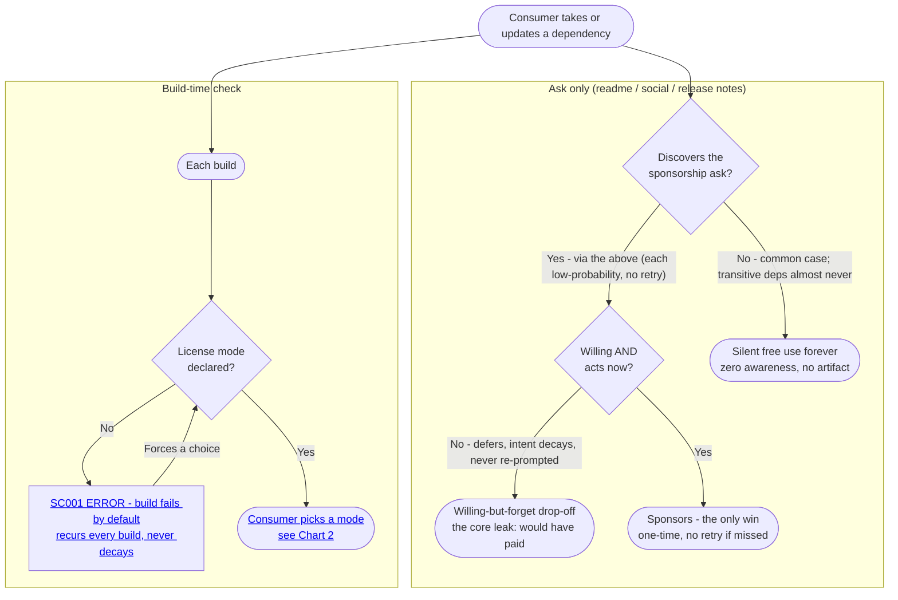
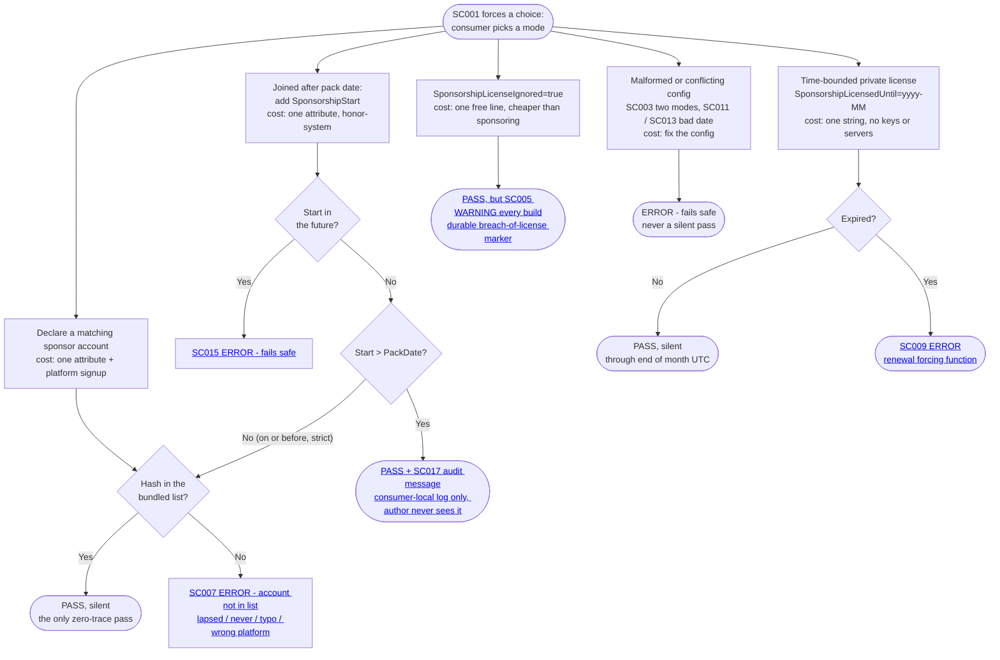
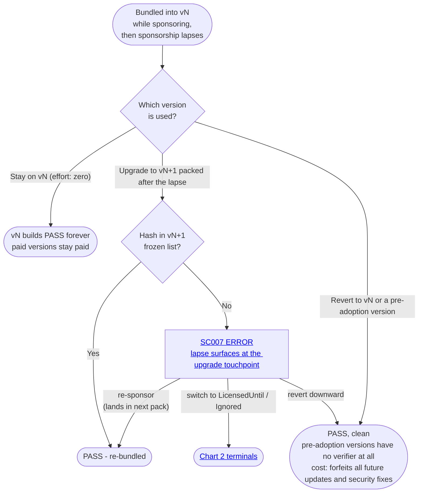
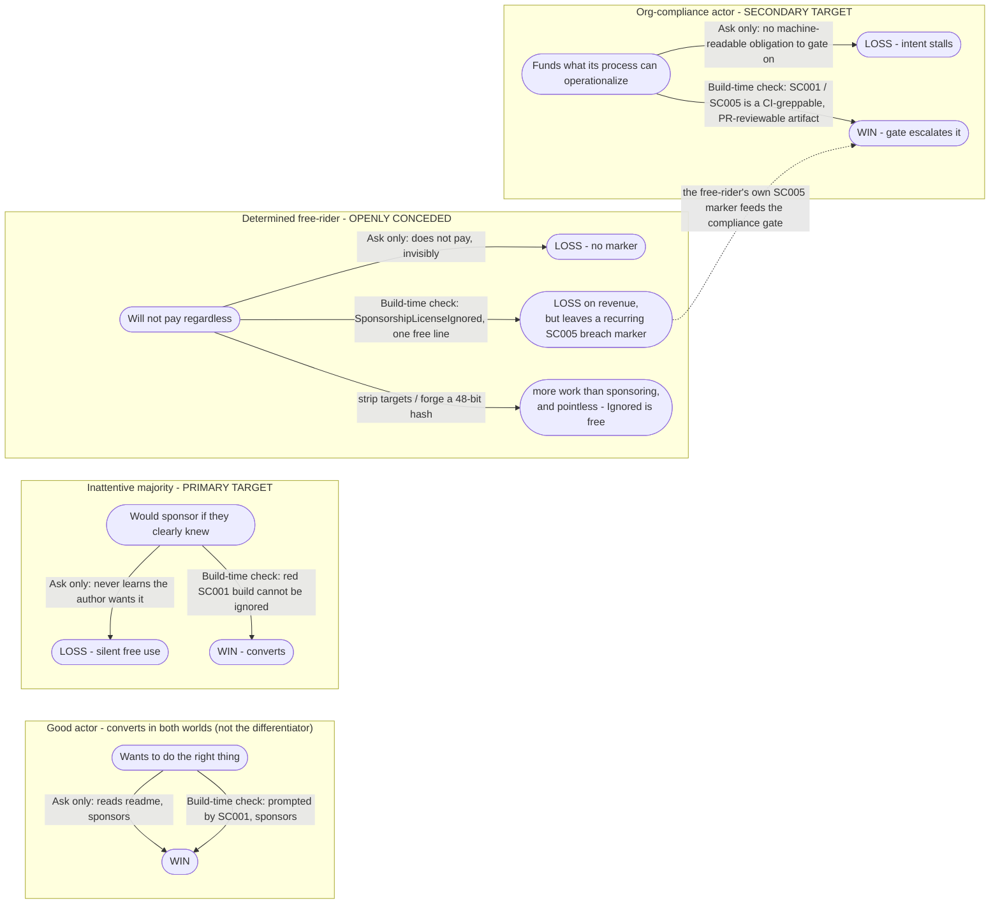

# Why build-time verification, not a readme ask alone

OSS sustainability mechanisms sit on a spectrum. At one end is **no enforcement** — ship the package and state, via the readme, social media, and release notes, that sponsorship is wanted. At the other is **full commercial licensing** — per-consumer license keys, a billing system, rotation, and support. The readme's [Why this approach](../readme.md#why-this-approach) section compares the three points at a high level. This document zooms in on the lower end: it justifies, scenario by scenario, why relocating the sponsorship ask into the build loop converts consumers that a readme/social/release-notes ask does not — and is honest about exactly where it stops working.

The charts below are **justification / contrast views**: they map what each world produces and what trace it leaves behind. They are a different altitude from the mechanism flowchart in [How it works](../readme.md#how-it-works), which shows the verifier's internal decision logic. That chart is not repeated here.

> **Throughout, every effort annotation is paired with the durability of the artifact it leaves.** This matters because the central lever is *not* that the honest path is cheaper — it is not. The documented bypass (`SponsorshipLicenseIgnored="true"`) is a single free line, strictly cheaper than signing up to sponsor. The lever is **visibility**: the honest path and every bypass differ not in keystrokes but in what they leave in the build log, in CI, and in code review. What matters is not what each choice costs but what it records — and that record is the consumer's own, never the maintainer's.

## 1. The premise: discovery is a single probabilistic event with no retry

The fatal property of the no-enforcement world is not that consumers are hostile — most are not. It is that the ask must be **discovered** through an out-of-band channel, discovery happens at most once, and it produces **zero durable artifact**. A consumer who would gladly sponsor can fall out of the funnel at every gate, and their own build, CI, and review hold no record of it — nothing the consumer's own process could later act on.

Automation makes this worse, not better. Adding or updating a dependency increasingly happens with no human in the loop — Dependabot and Renovate bumps, and AI coding agents that run `dotnet add package` and upgrade versions on a developer's behalf. None of them read a readme funding section, a changelog, or a social post, so the share of installs and upgrades where anyone even encounters the ask keeps shrinking.

SponsorCheck changes one thing: it moves the ask from a place read once (the readme) to a place read on every build (the build log). The verifier runs `BeforeTargets="BeforeBuild"` with **no configuration gate**, so it fires on *every* build in *every* configuration — including Debug, not at pack time or in Release alone. The prompt recurs and cannot decay — and the build is the one channel automation cannot skip: an AI agent or a CI bump still has to compile, so the verifier surfaces in exactly the output they read back.

The willing-but-forgetful drop-off on the left is the most damning leak: a consumer who *intended* to pay, saw the ask once, deferred it, and was never prompted again. On the right that leak is closed — not because the consumer is forced to pay, but because the reminder lives in the build loop instead of the readme, so the intention cannot quietly expire.

| Discovery channel (Ask only) | Consumer effort | Probability the ask lands | Durable artifact |
| --- | --- | --- | --- |
| Readme | Zero (incidental to reading docs they wanted) | Low — read once at evaluation, funding section below usage, skipped entirely by IDE/CLI or AI-agent installs | None |
| Release notes | Zero | Low — only on upgrade, and automated bumps (Dependabot/Renovate, AI agents) read no prose | None |
| Social media | Zero | Lowest — small overlap between followers and users; decays in hours | None |
| Transitive-only dependency | Zero | Near zero — the consumer never visits the package at all | None |

## 2. The structural fix, and three facts it rests on

The argument is "a recurring touchpoint beats a one-time impression." It rests on three properties of the
bundled verifier:

1. **It runs on every build.** The prompt is unavoidable and recurring rather than a single impression that scrolls away.
2. **`SC001` (no mode declared) is a default error that fails the build.** A consumer cannot proceed without consciously picking a mode — sponsor, license, or the explicit ignore. This is what converts the inattentive majority.
3. **The produced package carries no runtime dependency on SponsorCheck.** The verifier and its task DLL ship embedded in the nupkg; nothing reaches the consumer's runtime. The blast radius of being wrongly nagged is one build-time message, never a shipped dependency — which is why it is safe to err toward surfacing.

### Severity is one knob that slides the same tree from hard gate to soft nudge

The author tunes severity per overrideable code (`error` / `warning` / `message`) at pack time. The *same* decision tree runs in every case; only the forcefulness changes. Crucially, even the softest setting still beats no enforcement, because it still recurs in the build loop on every build.

| `NoLicenseSpecifiedSeverityOverride` | Consumer experience | Still beats no-enforcement? |
| --- | --- | --- |
| `error` (default) | Build fails until a mode is declared — hard gate | Yes |
| `warning` | Build passes; warns on every build (and is escalated by warnings-as-errors CI) | Yes |
| `message` | Build passes; a high-priority message recurs on every build | Yes — still a recurring touchpoint, unlike a readme |

## 3. Once forced to choose: every escape hatch leaves a trace

When `SC001` forces a decision, the consumer has several ways to resolve it. Exactly **one** terminal is a silent, zero-trace pass — a real sponsor match. Every other resolution either passes the build while leaving a durable artifact, or fails safe. This is the transition from *discovery* to *legibility*.

The honor-system `SponsorshipStart` path passes without any sponsorship lookup — it only checks that the attested date is not in the future and is strictly later than the package's pack date (so the bundled list *could not* contain the account). It logs an `SC017` audit message, but only in the consumer's own build log; the author never sees it. It is necessary for honest recent joiners, and it is also a stealthier free-ride path — both are true, and the doc does not pretend otherwise.

The terminal codes shown are the non-CPM (`<PackageReference>`) variants. A CPM consumer emits the `+1` sibling of each; an owner-mode consumer emits the `SC02x` equivalent. See [Verifier diagnostic codes](VerifierDiagnosticCodes.md).

## 4. Honesty, not DRM

Two facts must sit together so the document does not over-claim.

### 4a. Enforcement applies to new releases, not continued use

The bundled hash list is frozen per package version at pack time. The verifier has no notion of "currently sponsoring" — only "was this account's hash in *this version's* list." That produces a deliberate asymmetry: a version a consumer was bundled into stays buildable **forever**, even after sponsorship lapses. The lapse only bites on **upgrade**, when a newer version's frozen list no longer contains them. And a consumer can always revert downward to escape entirely.

Reverting is cheap in keystrokes — one `Version` string edited downward — but the real deterrent is not a build failure; it is the **compounding opportunity cost** of freezing out of all future updates and security fixes. Enforcement effectively scales with the value a consumer is actively extracting (new releases), not with mere continued use of what they already have. The author has no recall mechanism short of unlisting the package version.

### 4b. The conceded bypasses

SponsorCheck explicitly concedes that a determined free-rider can opt out trivially. Hashing is light obfuscation (48-bit truncated SHA-256), **not** a security boundary, and `SponsorshipLicenseIgnored="true"` is the documented, sanctioned bypass. Foregrounding this is what makes the rest credible: the design target is the inattentive majority, never the adversary.

- **`SponsorshipLicenseIgnored="true"`** — one free line. Strictly cheaper than sponsoring. Passes the build, but stamps an `SC005` "in breach of license" **warning on every build**, and the attribute itself is committed to the repo.
- **Revert the version** — see 4a. Clean build, no recurring `SC0xx`, at the cost of stale dependencies (which software-composition-analysis and Dependabot tooling will themselves flag).
- **Strip the verifier targets or forge a hash** — *more* work than sponsoring, and pointless, because the ignore bypass is free and sanctioned. No rational actor takes it, and an anti-SponsorCheck override target in `Directory.Build.targets` is exactly what a reviewer notices.

## 5. Who this actually converts

The good actor converts in both worlds, so they are not the differentiator. SponsorCheck recovers the **inattentive majority** (who never found out) and the **org-compliance actor** (who had nothing to operationalize against). The **determined free-rider** is openly conceded — but their own bypass becomes the compliance actor's conversion trigger.

The strongest non-obvious argument is the dotted edge: in an organization, the free-rider's `SC005` "in breach of license" warning is not the end of the story. Because diagnostics are emitted through standard MSBuild `LogWarning`/`LogError`, a warnings-as-errors CI gate, a license-compliance scan, or an ordinary PR review can escalate that marker into enforcement **at the consumer org's own discretion**. The individual's opt-out exposes the obligation that the organization then acts on. SponsorCheck does not coerce — it makes the decision *legible* and lets the consumer's own controls do the rest.

## 6. Author cost, and an honest limitation

Why an author picks this middle point on the spectrum at all comes down to cost. Adoption is near-zero: one development `PackageReference` plus a CI token, with the platform (GitHub Sponsors / Open Collective / Polar) still doing all the signup, billing, and rotation. Onboarding a sponsor is "they click Sponsor"; offboarding is "they stop sponsoring" — the next pack picks up the change automatically. No license keys are ever issued, in contrast to the large, ongoing cost of a full commercial licensing system.

One limitation, stated plainly so the document does not over-claim: **the author gets no per-consumer telemetry.** `SC005` and `SC017` are consumer-local — they live in the consumer's build log and never phone home. SponsorCheck cannot tell the author who ignored, who attested, or who reverted. It closes the *discovery* and *legibility* gaps; it does not give the author a dashboard of who is and is not paying. That is a shared limitation with the no-enforcement world, by design (no runtime callback, no tracking).

## End-state catalogue

Every distinct terminal state across both worlds, with the consumer's effort and what it leaves behind.

### Ask only

| End state | Consumer effort | Build-log artifact | Maintainer outcome |
| --- | --- | --- | --- |
| Silent free use forever (never discovered the ask; includes transitive-only deps) | Zero; no decision ever made | None | Loss — the exact inattentive majority SponsorCheck targets |
| Willing-but-forgetful drop-off (deferred, intent decayed, never re-prompted) | Intended to pay; never got a second touchpoint | None | Loss — a consumer who would have paid |
| Knowing free-ride (saw the ask, declined) | Zero ongoing; the decline is invisible | None — indistinguishable from an honest sponsor | Loss (conceded in both worlds) |
| Former sponsor lapses unnoticed (card expires, reorg) | Zero — lapse needs no action | None | Loss — no renewal touchpoint |
| Org wants to fund but has nothing to act on | Prohibitive manual per-dependency audit | None to gate or budget on | Loss — corporate intent stalls |
| Conscientious consumer sponsors proactively | ~3 clicks + payment, self-motivated, one-time | None (and none needed) | Win — conditioned on discover AND willing AND act-now firing at once |

### Build-time check

| End state | Consumer effort | Build-log artifact | Maintainer outcome |
| --- | --- | --- | --- |
| PASS, silent — real sponsor hash match | One attribute (copy-pasteable from SC001) + signup | None after the one-time SC001; a clean log is the reward | Win |
| PASS + SC017 audit message — `SponsorshipStart` > pack date | One extra attribute; no proof; self-expires on upgrade | SC017 high-priority message, consumer-local only | Neutral — needed for honest recent joiners; also a stealthier free-ride |
| PASS, silent — valid time-bounded private license | One `yyyy-MM` string; no keys/servers/rotation | Clean while valid; the value is visible in the repo | Win — B2B path without license infrastructure |
| PASS, but SC005 WARNING every build — explicit ignore | One free line — cheaper than sponsoring | Recurring SC005 breach marker in log/CI/PR + committed attribute | Neutral/loss on revenue, win on legibility — feeds the compliance gate |
| SC001 ERROR — no mode declared (default) | Zero to reach; one attribute to resolve | SC001 error with full remediation block + sponsor URLs | Win — the recurring forced prompt |
| SC007 ERROR — declared account not in the frozen list | Re-sponsor, switch mode, attest, or revert | SC007 error naming the tried accounts | Win — surfaces the lapse at the upgrade touchpoint |
| SC009 ERROR — time-bounded license expired | Update one `yyyy-MM` or sponsor | SC009 error naming the end-of-month UTC date | Win — calendar-driven renewal forcing function |
| SC015 ERROR — future `SponsorshipStart` (fails safe) | Use a real, non-future date | SC015 error — abuse attempt recorded, not honored | Win — fail-closed guard on the honor-system path |
| Malformed / conflicting config (SC003 / SC011 / SC013) | Fix the config | Recorded error — never degrades to a silent pass | Neutral — reinforces fail-closed auditability |
| SC018 ERROR — bundled hash file missing (corrupt install) | Restore/repair the package | SC018 error naming the missing path | Neutral — absence of audit substrate is itself surfaced |
| vN builds PASS forever after lapse — paid versions stay paid | Zero — stay on the bundled version | Clean build (hash still in vN's frozen list) | Neutral — deliberate; no recall short of unlisting |
| Revert to an already-bundled or pre-adoption version | Edit one `Version` down; forfeits all future updates and security fixes | No recurring SC0xx, but the pinned/stale version is visible to SCA tooling | Loss — the conceded escape; deterrent is compounding security debt |
| Strip the verifier / forge a 48-bit hash | More work than sponsoring, and pointless | A suspicious anti-SponsorCheck override a reviewer can spot | Loss — strictly dominated; hashing is not a security boundary |
| Stop using the package entirely | Rewrite/replace the dependency (highest effort) | None | Loss — nudged away rather than converted |

### Shared limitation (both worlds)

| End state | Artifact | Outcome |
| --- | --- | --- |
| Author never learns whether they are under-funded | None — SC005/SC017 are consumer-local; the author never sees them | Shared limitation, not a SponsorCheck win |

> One upstream precondition gates the entire Build-time check column: the author's pack must succeed. A missing platform credential (`SC102`), no configured platform account (`SC101`), or a platform fetch failure (`SC100`) is surfaced in the author's *own* pack log (see [Bundler diagnostic codes](BundlerDiagnosticCodes.md)) and determines whether a correct verifier ships at all.
