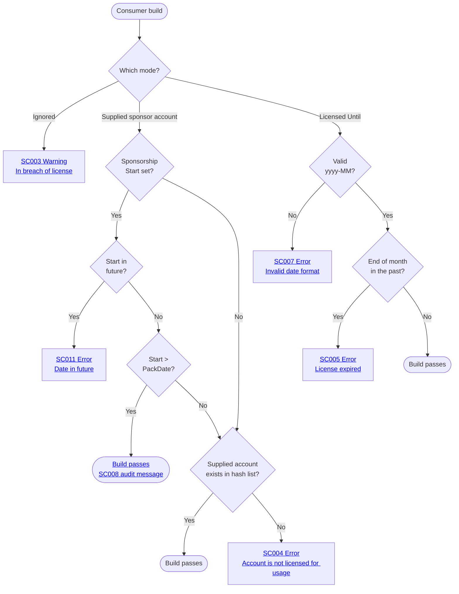

```mermaid
flowchart TD
    Start([Consumer build]) --> Which{Which mode?}

    Which -->|Ignored| SC003[<a href='https://github.com/SimonCropp/SponsorCheck/blob/main/docs/VerifierDiagnosticCodes.md#sc003'>SC003 Warning<br/>In breach of license</a>]

    Which -->|Supplied sponsor account| HasStart{Sponsorship<br/>Start set?}
    HasStart -->|Yes| Future{Start in<br/>future?}
    Future -->|Yes| SC011[<a href='https://github.com/SimonCropp/SponsorCheck/blob/main/docs/VerifierDiagnosticCodes.md#sc011'>SC011 Error<br/>Date in future</a>]
    Future -->|No| AfterPack{Start &gt;<br/>PackDate?}
    AfterPack -->|Yes| PassAttest([<a href='https://github.com/SimonCropp/SponsorCheck/blob/main/docs/VerifierDiagnosticCodes.md#sc008'>Build passes<br/>SC008 audit message</a>])
    AfterPack -->|No| Match
    HasStart -->|No| Match
    Match{Supplied account<br/>exists in hash list?}
    Match -->|Yes| PassSponsor([Build passes])
    Match -->|No| SC004[<a href='https://github.com/SimonCropp/SponsorCheck/blob/main/docs/VerifierDiagnosticCodes.md#sc004'>SC004 Error<br/>Account is not licensed for usage</a>]

    Which -->|Licensed Until| ParseYM{Valid<br/>yyyy-MM?}
    ParseYM -->|No| SC007[<a href='https://github.com/SimonCropp/SponsorCheck/blob/main/docs/VerifierDiagnosticCodes.md#sc007'>SC007 Error<br/>Invalid date format</a>]
    ParseYM -->|Yes| Expired{End of month<br/>in the past?}
    Expired -->|Yes| SC005[<a href='https://github.com/SimonCropp/SponsorCheck/blob/main/docs/VerifierDiagnosticCodes.md#sc005'>SC005 Error<br/>License expired</a>]
    Expired -->|No| PassLicense([Build passes])
```
