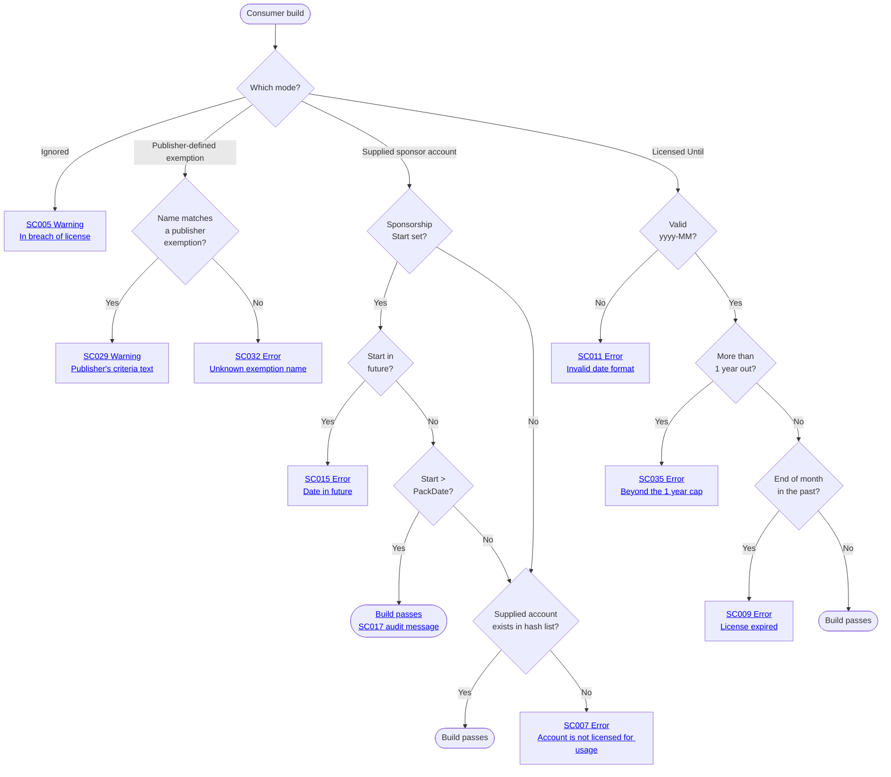

> The decision logic above is identical across all three placements; only the emitted code differs. Terminal codes shown are the non-CPM (`<PackageReference>`) variants. A CPM consumer (`<PackageVersion>` in `Directory.Packages.props`) emits the `+1` sibling of each ([SC005](https://github.com/SimonCropp/SponsorCheck/blob/main/docs/VerifierDiagnosticCodes.md#sc005)→[SC006](https://github.com/SimonCropp/SponsorCheck/blob/main/docs/VerifierDiagnosticCodes.md#sc006), [SC007](https://github.com/SimonCropp/SponsorCheck/blob/main/docs/VerifierDiagnosticCodes.md#sc007)→[SC008](https://github.com/SimonCropp/SponsorCheck/blob/main/docs/VerifierDiagnosticCodes.md#sc008), [SC029](https://github.com/SimonCropp/SponsorCheck/blob/main/docs/VerifierDiagnosticCodes.md#sc029)→[SC030](https://github.com/SimonCropp/SponsorCheck/blob/main/docs/VerifierDiagnosticCodes.md#sc030), [SC032](https://github.com/SimonCropp/SponsorCheck/blob/main/docs/VerifierDiagnosticCodes.md#sc032)→[SC033](https://github.com/SimonCropp/SponsorCheck/blob/main/docs/VerifierDiagnosticCodes.md#sc033), [SC035](https://github.com/SimonCropp/SponsorCheck/blob/main/docs/VerifierDiagnosticCodes.md#sc035)→[SC036](https://github.com/SimonCropp/SponsorCheck/blob/main/docs/VerifierDiagnosticCodes.md#sc036), …). An [owner-mode](https://github.com/SimonCropp/SponsorCheck/blob/main/docs/VerifierDiagnosticCodes.md#sc021) consumer (sponsorship set via a global MSBuild property) emits the SC021–SC028 equivalent for the original modes (Ignored→[SC023](https://github.com/SimonCropp/SponsorCheck/blob/main/docs/VerifierDiagnosticCodes.md#sc023), no match→[SC024](https://github.com/SimonCropp/SponsorCheck/blob/main/docs/VerifierDiagnosticCodes.md#sc024), expired→[SC025](https://github.com/SimonCropp/SponsorCheck/blob/main/docs/VerifierDiagnosticCodes.md#sc025), invalid date→[SC026](https://github.com/SimonCropp/SponsorCheck/blob/main/docs/VerifierDiagnosticCodes.md#sc026), future start→[SC028](https://github.com/SimonCropp/SponsorCheck/blob/main/docs/VerifierDiagnosticCodes.md#sc028)) plus [SC031](https://github.com/SimonCropp/SponsorCheck/blob/main/docs/VerifierDiagnosticCodes.md#sc031)/[SC034](https://github.com/SimonCropp/SponsorCheck/blob/main/docs/VerifierDiagnosticCodes.md#sc034) for the exemption branch and [SC037](https://github.com/SimonCropp/SponsorCheck/blob/main/docs/VerifierDiagnosticCodes.md#sc037) for the one-year cap; [SC017](https://github.com/SimonCropp/SponsorCheck/blob/main/docs/VerifierDiagnosticCodes.md#sc017) is shared. The exemption branch only fires when the publisher defined `<SponsorExemption>` items at pack time — packages without any exemptions never reach `KnownName`.

