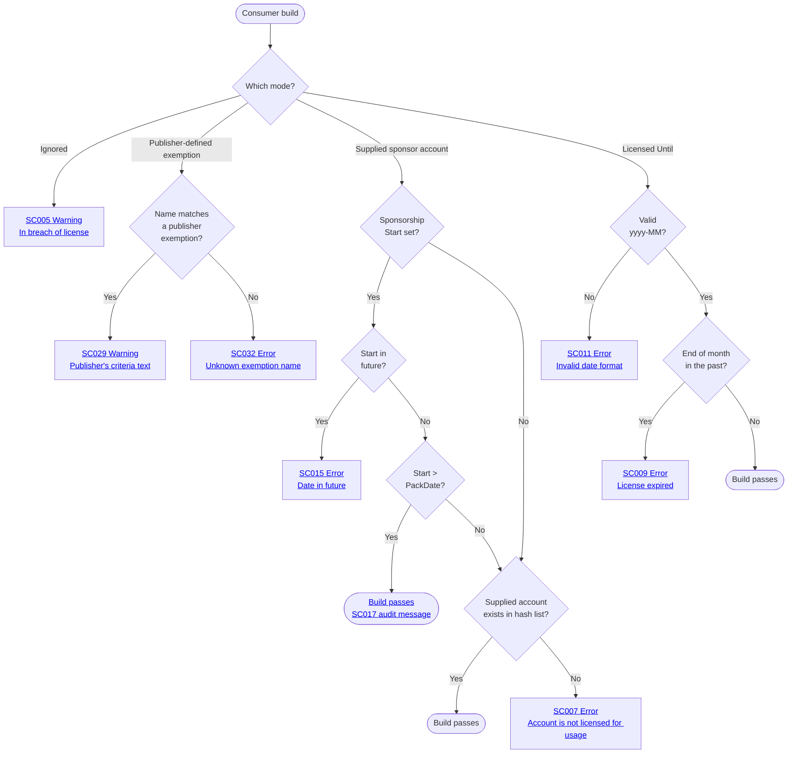

#  SponsorCheck

[](https://ci.appveyor.com/project/SimonCropp/SponsorCheck)
[](https://www.nuget.org/packages/SponsorCheck/)


Build-time sponsorship verification for NuGet packages — nudge consumers of an OSS library to sponsor its author, in the spirit of the [Open Source Maintenance Fee](https://opensourcemaintenancefee.org/). Gentle nudging plus honesty rather than runtime DRM.

OSS authors install `SponsorCheck` as a development dependency in their library project. At pack time, a Bundler MSBuild task fetches the author's sponsor list from one or more configured **sponsorship platforms** (GitHub Sponsors, Open Collective, Polar), hashes each account, and bundles a build-time verifier into the produced NuGet package — *without* adding any runtime dependency to that package.

When consumers reference the produced package, the bundled verifier runs on every build and requires one of three license-mode: a sponsor account that matches the bundled list, a time-bounded private license, or an explicit "ignored" with a build warning.

Jump to [OSS author setup](#oss-author-setup) or [Consumer Usage](#consumer-usage).


## Why this approach

OSS sustainability mechanisms sit on a spectrum. SponsorCheck targets a specific point on it; here's how it compares to the two extremes.


### No checking

Ship the package, link to GitHub Sponsors / Open Collective / Polar in the readme, and hope consumers act on it.

- **Maintainer cost:** zero. No tooling, no list to manage, no support burden.
- **Consumer cost:** zero. Nothing to wire up.
- **Outcome:** the conversion rate from *uses-the-package* to *sponsors-the-author* is small. The readme is read once at install and then forgotten — there's no signal in the day-to-day build loop that the package isn't free.


### Full commercial licensing

Require a license key per consumer, issued by the maintainer, validated at build or runtime.

- **Maintainer cost:** large and ongoing. License-issuing system, key rotation, billing / dunning, refunds, evaluation-license exceptions, and a steady stream of license-key support traffic. Effectively a commercial product running alongside the OSS project.
- **Consumer cost:** non-trivial. License keys to store securely in CI, plumb into Docker images, and rotate before expiry.
- **Outcome:** strong enforcement and predictable revenue, at the cost of OSS-style frictionlessness on both sides. For a side-project maintainer, the per-license overhead can exceed the revenue captured.


### SponsorCheck — build-time nudge against an existing platform

The maintainer keeps using GitHub Sponsors / Open Collective / Polar and ships a bundled hash list with each pack. Consumers see an `SC0xx` entry in their build log if they aren't on the list, with documented escape hatches.

- **Maintainer cost:** the platform still does all the work — signup, billing, rotation, the public list of supporters. No license keys ever issued. Onboarding a sponsor is "they click Sponsor"; offboarding is "they stop sponsoring" — the next pack picks up the change automatically.
- **Consumer cost:** one metadata attribute on the `PackageReference` (or `PackageVersion` under Central Package Management) for sponsor-match mode, or a single `yyyy-MM` string for time-bounded private licenses. No keys, no servers, no rotation.
- **Outcome:** every build either passes silently, emits a "please sponsor" error/warning the developer sees in their actual workflow, or — under `SponsorshipLicenseIgnored="true"` — passes with a visible breach-of-license warning that follows the build through CI and code review.

The trade for staying frictionless is honesty: hashing is not a security boundary, `SponsorshipLicenseIgnored="true"` is the documented bypass, and anyone determined to free-ride can do so trivially. The intent is to convert the inattentive majority — teams that would happily sponsor if they knew the maintainer wanted them to — not to extract revenue from adversaries.

For a scenario-by-scenario walk-through of why a recurring build-loop nudge converts consumers that a readme/social/release-notes ask does not — mapped as flowcharts across discovery, actor type, effort, version-reverting, and every end state — see [Why build-time verification](docs/WhyBuildTimeVerification.md).


## Consumer Usage


### License modes

The license modes (sponsor account, time-bounded license, ignore) are mutually exclusive — pick exactly one. Where the declaration lives depends on how the package is configured:

- **Without CPM**, set the metadata on the consumer csproj's `<PackageReference>`.
- **With CPM** (`ManagePackageVersionsCentrally=true`), set it on the matching `<PackageVersion>` in `Directory.Packages.props`.
- **In [owner mode](#owner-mode)** (the author opted the package in), set the license mode as a global MSBuild property instead of per-package metadata — once, covering every package from that owner.

For the per-package modes, setting the metadata on the wrong element raises [wrong location - SC020](docs/VerifierDiagnosticCodes.md#sc020) — the diagnostic message names the misplaced attribute(s) and the file they should move to. [set on both - SC019](docs/VerifierDiagnosticCodes.md#sc019) is a defensive backstop for the rare case where [SC020](docs/VerifierDiagnosticCodes.md#sc020)'s check is bypassed. (Owner mode reads a single property, so neither applies.)

Verifier diagnostics that prompt changes to consumer-side configuration ([SC001](docs/VerifierDiagnosticCodes.md#sc001)/[SC002](docs/VerifierDiagnosticCodes.md#sc002), [SC005](docs/VerifierDiagnosticCodes.md#sc005)/[SC006](docs/VerifierDiagnosticCodes.md#sc006), [SC007](docs/VerifierDiagnosticCodes.md#sc007)/[SC008](docs/VerifierDiagnosticCodes.md#sc008), [SC009](docs/VerifierDiagnosticCodes.md#sc009)/[SC010](docs/VerifierDiagnosticCodes.md#sc010), [SC011](docs/VerifierDiagnosticCodes.md#sc011)/[SC012](docs/VerifierDiagnosticCodes.md#sc012), [SC013](docs/VerifierDiagnosticCodes.md#sc013)/[SC014](docs/VerifierDiagnosticCodes.md#sc014), [SC015](docs/VerifierDiagnosticCodes.md#sc015)/[SC016](docs/VerifierDiagnosticCodes.md#sc016), and the owner-mode [SC021–SC028](docs/VerifierDiagnosticCodes.md#sc021)) render a copy-pasteable snippet pre-filled with the package id, version, and the file to edit. Each odd/even pair is the non-CPM / CPM sibling of the same condition; SC021–SC028 are the owner-mode (global-property) equivalents.


#### Sponsor account match (any platform)

<!-- snippet: Consumer.ValidGitHubSponsor.csproj -->
<a id='snippet-Consumer.ValidGitHubSponsor.csproj'></a>
```csproj
<Project Sdk="Microsoft.NET.Sdk">
  <PropertyGroup>
    <TargetFramework>net10.0</TargetFramework>
  </PropertyGroup>
  <ItemGroup>
    <PackageReference
      Include="ThePackage"
      Version="1.0.0"
      GitHubSponsorAccount="alice" />
  </ItemGroup>
</Project>
```
<sup><a href='/IntegrationTests/Fixtures/Consumer.ValidGitHubSponsor/Consumer.ValidGitHubSponsor.csproj#L1-L11' title='Snippet source file'>snippet source</a> | <a href='#snippet-Consumer.ValidGitHubSponsor.csproj' title='Start of snippet'>anchor</a></sup>
<!-- endSnippet -->

When the package author accepts multiple platforms and the consumer sponsors on one of them, supply the matching `<Platform>SponsorAccount` metadata. Multiple values are allowed — the verifier passes if **any** account matches the bundled list.


##### Why multiple accounts are useful

A consumer organisation may sponsor different OSS authors across different platforms. Say `acmecorp` sponsors one library author on **GitHub Sponsors** and a different author on **Open Collective**. When packages from both authors land in the same consumer project, both `GitHubSponsorAccount="acmecorp"` and `OpenCollectiveSponsorAccount="acme-org"` need to be present so each package's bundled hash list finds its match. The verifier short-circuits on the first hit, so the cost is one cheap hash lookup per declared platform per package.

Without "any match" semantics the consumer would have to:

- Know in advance which platform each package's author publishes on.
- Track that mapping over time — an author switching platforms would break every consumer.
- Branch the metadata per package, likely via separate `<PackageReference>` items with conditional metadata.

Other reasons the same shape matters:

- **Sponsorship migration.** An author moving from GitHub Sponsors to Open Collective ships a new package version with the new hash list. Existing consumers who already have both attributes set keep building without a metadata change.
- **Personal vs org accounts.** A developer might sponsor as a personal GitHub handle for some authors and via their org's Open Collective for others. Both can sit side-by-side on the same `<PackageReference>` / `<PackageVersion>`.
- **Reduced churn in `Directory.Packages.props`.** In a monorepo, the consumer's sponsorship identities are set once at the top level. Every project that references a SponsorCheck-using package inherits all of them without per-project tuning.


##### Recent sponsors: SponsorshipStart

The bundled hash list is frozen at the package's pack date. When sponsorship begins *after* the package was released, the account cannot possibly be in the list. Add `SponsorshipStart="yyyy-MM-dd"` to attest to the start date:

```xml
<PackageReference
  Include="ThePackage"
  Version="1.0"
  GitHubSponsorAccount="carol"
  SponsorshipStart="2026-04-30" />
```

If `SponsorshipStart` is **after** the package's pack date, the verifier trusts the declaration and emits a [trusted SponsorshipStart - SC017](docs/VerifierDiagnosticCodes.md#sc017) high-priority build message naming the unverified sponsor (audit trail in the consumer's own build log). If `SponsorshipStart` is on or before the pack date (including equal — the boundary is strict), the hash check is enforced as normal: claiming to be a sponsor at release time means the account should already be in the bundled list.

`SponsorshipStart` in the future fails with [future SponsorshipStart - SC015](docs/VerifierDiagnosticCodes.md#sc015). Once the OSS author ships a new version of ThePackage that includes the new sponsor in its hash list **and the consumer upgrades to it**, `SponsorshipStart` can be dropped. If the consumer stays on the older version, the attestation must remain.


#### Sponsor account match (owner mode)

When the author opted the package into [owner mode](#owner-mode), the same sponsor-account match is declared once as a global MSBuild property rather than `<PackageReference>` metadata. The property names are **scoped by the package's owner id** — `{owner}_GitHubSponsorAccount`, `{owner}_OpenCollectiveSponsorAccount`, `{owner}_PolarSponsorAccount` — so a consumer of packages from two different owners can configure each one independently (e.g. sponsor `acme` from a personal handle and `papyrine-corp` from an org). The owner id is baked into the package at pack time and is part of the SC021 error message, so there is no guessing about what to type:

<!-- snippet: Consumer.OwnerCsprojProperty.csproj -->
<a id='snippet-Consumer.OwnerCsprojProperty.csproj'></a>
```csproj
<Project Sdk="Microsoft.NET.Sdk">
  <PropertyGroup>
    <TargetFramework>net10.0</TargetFramework>
    <!-- Owner mode: sponsorship configured as a global MSBuild property, here directly in the csproj. -->
    <acme_GitHubSponsorAccount>alice</acme_GitHubSponsorAccount>
  </PropertyGroup>
  <ItemGroup>
    <PackageReference Include="ThePackageOwnerMode" Version="1.0.0" />
  </ItemGroup>
</Project>
```
<sup><a href='/IntegrationTests/Fixtures/Consumer.OwnerCsprojProperty/Consumer.OwnerCsprojProperty.csproj#L1-L10' title='Snippet source file'>snippet source</a> | <a href='#snippet-Consumer.OwnerCsprojProperty.csproj' title='Start of snippet'>anchor</a></sup>
<!-- endSnippet -->

The property can sit in the consuming csproj (above) or once in `Directory.Build.props` to cover every owner-mode package under that directory. The any-match rule is unchanged: declare one property per platform the consumer sponsors on, and the verifier passes if any matches the bundled list. `SponsorshipStart` works identically as a property for sponsors who joined after the pack date. Owner-mode builds surface the [SC021–SC028](docs/VerifierDiagnosticCodes.md#sc021) diagnostics in place of their per-package siblings — see [Owner mode](#owner-mode) for how a family of packages from one owner de-duplicates to a single check and how a package migrates into or out of owner mode.


#### Sponsorship lifecycle: what happens after sponsorship lapses

The bundled hash list is frozen per package version. The verifier has no notion of "currently sponsoring" — it only checks whether the consumer's account hash was in the list at pack time, or whether the consumer has attested to a `SponsorshipStart` after that pack date. That has three practical consequences when sponsorship lapses:

1. **Already-bundled versions stay buildable forever.** If the consumer's account hash was bundled into v1.1 at the time it was packed, the verifier keeps accepting it for v1.1 builds even after the consumer stops sponsoring. Versions paid for stay paid for; the OSS author has no recall mechanism short of yanking the package.
2. **Newer versions packed after a lapse reject the consumer.** If the author ships v1.2 after the consumer stops, the consumer's hash is not in v1.2's bundled list and a hash-only check fails with [no sponsor match - SC007](docs/VerifierDiagnosticCodes.md#sc007). To upgrade, the consumer must either re-sponsor (so the hash lands in the next pack), switch the package to `SponsorshipLicensedUntil="yyyy-MM"`, or opt out with `SponsorshipLicenseIgnored="true"` (which emits the [license ignored - SC005](docs/VerifierDiagnosticCodes.md#sc005) warning on every build).
3. **`SponsorshipStart` is honor-system but self-expiring.** The verifier cannot tell whether the consumer is currently sponsoring; it only checks that the attested start date is `> PackDate` and `<= today`. While the consumer stays on the package version where the attestation was added, leaving it in after a lapse keeps the build passing — same shape as bullet 1 (paid versions stay paid). On upgrade, the newer `PackDate` overtakes the attested start, the bypass stops firing, and bullet 2 takes over (lapsed sponsors fail with [no sponsor match - SC007](docs/VerifierDiagnosticCodes.md#sc007)). So `SponsorshipStart` doesn't need to be cleaned up proactively — leaving it in place is harmless. The only audit signal while the bypass is active is the [trusted SponsorshipStart - SC017](docs/VerifierDiagnosticCodes.md#sc017) message in the consumer's own build log; the OSS author never sees it.


### Time-bounded private license

<!-- snippet: Consumer.FutureLicense.csproj -->
<a id='snippet-Consumer.FutureLicense.csproj'></a>
```csproj
<Project Sdk="Microsoft.NET.Sdk">
  <PropertyGroup>
    <TargetFramework>net10.0</TargetFramework>
  </PropertyGroup>
  <ItemGroup>
    <PackageReference
      Include="ThePackage"
      Version="1.0.0"
      SponsorshipLicensedUntil="2099-12" />
  </ItemGroup>
</Project>
```
<sup><a href='/IntegrationTests/Fixtures/Consumer.FutureLicense/Consumer.FutureLicense.csproj#L1-L11' title='Snippet source file'>snippet source</a> | <a href='#snippet-Consumer.FutureLicense.csproj' title='Start of snippet'>anchor</a></sup>
<!-- endSnippet -->

For private B2B licensing arrangements outside of the platforms. Format is `yyyy-MM`; the license is valid through the end of that month UTC.

In [owner mode](#owner-mode) the same license is declared once as a global `{owner}_SponsorshipLicensedUntil` property — in the consuming csproj or in `Directory.Build.props` — rather than `<PackageReference>` metadata:

<!-- snippet: Consumer.OwnerFutureLicense.csproj -->
<a id='snippet-Consumer.OwnerFutureLicense.csproj'></a>
```csproj
<Project Sdk="Microsoft.NET.Sdk">
  <PropertyGroup>
    <TargetFramework>net10.0</TargetFramework>
    <!-- Owner mode: a time-bounded private license configured as a global MSBuild property. Valid through end of 2099-12 UTC. -->
    <acme_SponsorshipLicensedUntil>2099-12</acme_SponsorshipLicensedUntil>
  </PropertyGroup>
  <ItemGroup>
    <PackageReference Include="ThePackageOwnerMode" Version="1.0.0" />
  </ItemGroup>
</Project>
```
<sup><a href='/IntegrationTests/Fixtures/Consumer.OwnerFutureLicense/Consumer.OwnerFutureLicense.csproj#L1-L10' title='Snippet source file'>snippet source</a> | <a href='#snippet-Consumer.OwnerFutureLicense.csproj' title='Start of snippet'>anchor</a></sup>
<!-- endSnippet -->

An expired value fails with [SC025](docs/VerifierDiagnosticCodes.md#sc025), the owner-mode counterpart of the per-package [SC009](docs/VerifierDiagnosticCodes.md#sc009)/[SC010](docs/VerifierDiagnosticCodes.md#sc010).


### Explicit ignore

An escape hatch to disable licensing.

<!-- snippet: Consumer.IgnoredLicense.csproj -->
<a id='snippet-Consumer.IgnoredLicense.csproj'></a>
```csproj
<Project Sdk="Microsoft.NET.Sdk">
  <PropertyGroup>
    <TargetFramework>net10.0</TargetFramework>
  </PropertyGroup>
  <ItemGroup>
    <PackageReference
      Include="ThePackage"
      Version="1.0.0"
      SponsorshipLicenseIgnored="true" />
  </ItemGroup>
</Project>
```
<sup><a href='/IntegrationTests/Fixtures/Consumer.IgnoredLicense/Consumer.IgnoredLicense.csproj#L1-L11' title='Snippet source file'>snippet source</a> | <a href='#snippet-Consumer.IgnoredLicense.csproj' title='Start of snippet'>anchor</a></sup>
<!-- endSnippet -->

Build passes but emits the [license ignored - SC005](docs/VerifierDiagnosticCodes.md#sc005) warning on every build, flagging that the build is in breach of the package's license.


### Publisher-defined exemptions

`SponsorshipLicenseIgnored` is the universal opt-out, but the warning frames the consumer as in breach. Many publishers carve out scenarios where consumption is *legitimately* free — pre-existing customers, consulting clients, small businesses below a revenue threshold, etc. Those consumers shouldn't ship a "breach of license" warning through CI for the lifetime of every build.

Publishers can define named **exemptions** at pack time (see [Defining exemptions](#defining-exemptions) below). Consumers claim one by name; the build passes with a warning whose body is the publisher's own criteria text — so CI logs and code review show the exact exemption being claimed instead of a generic breach message.

<!-- snippet: Consumer.Exemption.csproj -->
<a id='snippet-Consumer.Exemption.csproj'></a>
```csproj
<Project Sdk="Microsoft.NET.Sdk">
  <PropertyGroup>
    <TargetFramework>net10.0</TargetFramework>
  </PropertyGroup>
  <ItemGroup>
    <PackageReference
      Include="ThePackageWithExemptions"
      Version="1.0.0"
      SponsorshipExemption="Consulting" />
  </ItemGroup>
</Project>
```
<sup><a href='/IntegrationTests/Fixtures/Consumer.Exemption/Consumer.Exemption.csproj#L1-L11' title='Snippet source file'>snippet source</a> | <a href='#snippet-Consumer.Exemption.csproj' title='Start of snippet'>anchor</a></sup>
<!-- endSnippet -->

Under CPM (Central Package Management), the metadata moves to `<PackageVersion>` in `Directory.Packages.props`:

<!-- snippet: Consumer.CpmExemption.Directory.Packages.props -->
<a id='snippet-Consumer.CpmExemption.Directory.Packages.props'></a>
```props
<PropertyGroup>
  <ManagePackageVersionsCentrally>true</ManagePackageVersionsCentrally>
</PropertyGroup>
<ItemGroup>
  <PackageVersion Include="ThePackageWithExemptions" Version="1.0.0"
                  SponsorshipExemption="SmallRevenue" />
</ItemGroup>
```
<sup><a href='/IntegrationTests/Fixtures/Consumer.CpmExemption/Directory.Packages.props#L2-L10' title='Snippet source file'>snippet source</a> | <a href='#snippet-Consumer.CpmExemption.Directory.Packages.props' title='Start of snippet'>anchor</a></sup>
<!-- endSnippet -->

In owner mode, the property uses the owner prefix:

<!-- snippet: Consumer.OwnerExemption.csproj -->
<a id='snippet-Consumer.OwnerExemption.csproj'></a>
```csproj
<Project Sdk="Microsoft.NET.Sdk">
  <PropertyGroup>
    <TargetFramework>net10.0</TargetFramework>
    <!-- Owner-mode opt-in via the owner-prefixed global property. -->
    <acme_SponsorshipExemption>Consulting</acme_SponsorshipExemption>
  </PropertyGroup>
  <ItemGroup>
    <PackageReference Include="ThePackageOwnerModeWithExemptions" Version="1.0.0" />
  </ItemGroup>
</Project>
```
<sup><a href='/IntegrationTests/Fixtures/Consumer.OwnerExemption/Consumer.OwnerExemption.csproj#L1-L10' title='Snippet source file'>snippet source</a> | <a href='#snippet-Consumer.OwnerExemption.csproj' title='Start of snippet'>anchor</a></sup>
<!-- endSnippet -->

Build passes with a warning ([SC029](docs/VerifierDiagnosticCodes.md#sc029) / [SC030](docs/VerifierDiagnosticCodes.md#sc030) / [SC031](docs/VerifierDiagnosticCodes.md#sc031) for non-CPM / CPM / owner mode) whose body is the publisher's criteria text verbatim. Naming an exemption the publisher did not define fails the build with [SC032](docs/VerifierDiagnosticCodes.md#sc032) / [SC033](docs/VerifierDiagnosticCodes.md#sc033) / [SC034](docs/VerifierDiagnosticCodes.md#sc034); the error body lists the available exemptions so the consumer can correct.

Lookup is case-insensitive but the warning text echoes the consumer-typed casing — what's in the audit trail is exactly what the consumer wrote.


### Owner mode

By default each package is configured independently — the license mode lives on that package's `<PackageReference>` (or `<PackageVersion>`). When an author ships a family of packages covered by a single sponsor account (e.g. several libraries under one GitHub org), they can opt into **owner mode** so consumers configure sponsorship **once**, as a global MSBuild property that covers every package from that owner.

The same license modes apply (sponsor account, time-bounded license, ignore) but are set as plain properties rather than per-package metadata — directly in a consuming project:

<!-- snippet: Consumer.OwnerCsprojProperty.csproj -->
<a id='snippet-Consumer.OwnerCsprojProperty.csproj'></a>
```csproj
<Project Sdk="Microsoft.NET.Sdk">
  <PropertyGroup>
    <TargetFramework>net10.0</TargetFramework>
    <!-- Owner mode: sponsorship configured as a global MSBuild property, here directly in the csproj. -->
    <acme_GitHubSponsorAccount>alice</acme_GitHubSponsorAccount>
  </PropertyGroup>
  <ItemGroup>
    <PackageReference Include="ThePackageOwnerMode" Version="1.0.0" />
  </ItemGroup>
</Project>
```
<sup><a href='/IntegrationTests/Fixtures/Consumer.OwnerCsprojProperty/Consumer.OwnerCsprojProperty.csproj#L1-L10' title='Snippet source file'>snippet source</a> | <a href='#snippet-Consumer.OwnerCsprojProperty.csproj' title='Start of snippet'>anchor</a></sup>
<!-- endSnippet -->

…or once in `Directory.Build.props`, so it applies to every project under that directory (the natural fit for a monorepo or solution):

```xml
<Project>
  <PropertyGroup>
    <acme_GitHubSponsorAccount>alice</acme_GitHubSponsorAccount>
  </PropertyGroup>
</Project>
```

Property names are the per-package metadata names prefixed with `{owner}_`: `{owner}_GitHubSponsorAccount`, `{owner}_OpenCollectiveSponsorAccount`, `{owner}_PolarSponsorAccount`, `{owner}_SponsorshipLicensedUntil`, `{owner}_SponsorshipLicenseIgnored`, and `{owner}_SponsorshipStart`. The prefix keeps each owner's settings separate when a consumer references owner-mode packages from multiple authors. Owner-mode builds emit the [SC021–SC028](docs/VerifierDiagnosticCodes.md#sc021) family — the single-source equivalents of the per-package [SC001–SC016](docs/VerifierDiagnosticCodes.md#sc001) codes (e.g. [SC021](docs/VerifierDiagnosticCodes.md#sc021) is the owner-mode "no license specified", [SC024](docs/VerifierDiagnosticCodes.md#sc024) the "account not in list"). Whether a package uses owner mode is decided by the author at pack time; a consumer can't switch a per-package package into owner mode or vice versa.


#### Migrating to or from owner mode

The mode is fixed per package version at pack time, so it can change on upgrade — a version published in per-package mode reads the `<PackageReference>` / `<PackageVersion>` metadata, while a version published in owner mode reads the global property. The two are independent MSBuild sources, so neither reads the other.

A flip never mis-verifies silently: if sponsorship is declared in the place the new version doesn't read, the build fails with a clear code — [SC021](docs/VerifierDiagnosticCodes.md#sc021) when a package moves *into* owner mode (set the property), or [SC001](docs/VerifierDiagnosticCodes.md#sc001)/[SC002](docs/VerifierDiagnosticCodes.md#sc002) when it moves *out* (set the metadata).

Because the two sources don't interfere, a consumer can ride out the transition with **zero failed builds** by declaring sponsorship in *both* places at once:

```xml
<!-- Directory.Build.props — read by owner-mode packages whose SponsorOwner is "acme" -->
<PropertyGroup>
  <acme_GitHubSponsorAccount>alice</acme_GitHubSponsorAccount>
</PropertyGroup>
```

```xml
<!-- the consuming csproj (or Directory.Packages.props under CPM) — read by per-package packages -->
<PackageReference Include="ThePackage" Version="1.1.0" GitHubSponsorAccount="alice" />
```

Owner-mode packages read the property and per-package packages read the metadata, with no conflict — so a mixed fleet, where some referenced versions have flipped and some haven't, all builds cleanly. Once every referenced package is on the same mode, the now-unused declaration can be dropped.


### Diagnostic codes

[Verifier diagnostic codes (SC0xx)](docs/VerifierDiagnosticCodes.md) — emitted in consumer projects.


## OSS author setup

Add `SponsorCheck` as a `PrivateAssets="all"` development dependency on the library project, with one `<Platform>Account` metadatum per supported platform.

<!-- snippet: ThePackage.csproj -->
<a id='snippet-ThePackage.csproj'></a>
```csproj
<Project Sdk="Microsoft.NET.Sdk">
  <PropertyGroup>
    <TargetFramework>netstandard2.0</TargetFramework>
  </PropertyGroup>
  <ItemGroup>
    <PackageReference Include="SponsorCheck" Version="$(SponsorCheckVersion)"
                      PrivateAssets="all"
                      GitHubSponsorsAccount="acmecorp"
                      OpenCollectiveAccount="acme-org"
                      PolarAccount="acme" />
  </ItemGroup>
</Project>
```
<sup><a href='/IntegrationTests/Fixtures/_Shared/ThePackage/ThePackage.csproj#L1-L12' title='Snippet source file'>snippet source</a> | <a href='#snippet-ThePackage.csproj' title='Start of snippet'>anchor</a></sup>
<!-- endSnippet -->


### Platforms

At least one `<Platform>Account` must be set. Credentials per platform:


#### [GitHub Sponsors](https://github.com/open-source/sponsors)

 * MSBuild property: `<GitHubToken>`
 * Env var: `GitHubToken` (auto-imported into the MSBuild property of the same name)
 * User-secrets key: `SponsorCheck:GitHubToken`

Required - [classic PAT](https://github.com/settings/tokens/new) with `read:user`, plus `read:org` if sponsored as an organization. `read:user` is always required because the bundler reads per-sponsorship metadata (`isOneTimePayment`, `createdAt`, `isActive`) from `sponsorshipsAsMaintainer`, and GitHub gates those fields on `read:user` even when the maintainer is an organization. Fine-grained PATs don't expose a Sponsorships permission, so a classic PAT is the only option. The token must be owned by the sponsored account (or an admin of the sponsored org) — otherwise private sponsors are silently filtered out and the bundled hash list will be incomplete.

Some organizations disable classic-PAT access in their security settings. When sponsored as such an org, a classic PAT will fail with a `FORBIDDEN` error from GitHub at pack time and the bundler emits an actionable message. The org admin needs to re-enable classic-PAT access for the sponsored org.

##### One-time sponsors

One-time GitHub sponsors are bundled for **one month from the payment date**. After that window the entry drops out of the next pack — the same behaviour a monthly sponsor gets after one billing cycle of non-renewal.

For this to map cleanly to "an effective month of sponsor status", set GitHub Sponsors' **"Set minimum amount"** (under [Sponsor profile → Tiers](https://github.com/sponsors)) to the **same value as the lowest monthly tier**. That way any one-time sponsorship is priced at least as much as a single month at the entry tier, so the one-month bundle window is paid for. If the minimum is lower than the monthly tier, one-time sponsors get the full month of sponsor status for less than the recurring sponsors pay — usually not the intent.

Recurring sponsors are bundled while their sponsorship is active and dropped as soon as it lapses, independent of this window.


#### [OpenCollective](https://opencollective.com)

 * MSBuild property: `<OpenCollectiveToken>`
 * Env var: `OpenCollectiveToken` (auto-imported into the MSBuild property of the same name)
 * User-secrets key: `SponsorCheck:OpenCollectiveToken`

Optional - public collectives are queryable anonymously, but anonymous calls hit rate limits on collectives with many backers. Create a [Personal Token](https://opencollective.com/applications) (no scopes required — the token is used for rate-limit headroom, not access).


#### [Polar](https://polar.sh)

 * MSBuild property: `<PolarToken>`
 * Env var: `PolarToken` (auto-imported into the MSBuild property of the same name)
 * User-secrets key: `SponsorCheck:PolarToken`

Required - [organization access token](https://docs.polar.sh/integrate/authentication/personal-access-token) with scopes `subscriptions:read`, `customers:read`, `organizations:read`. The customer scope matters: without it Polar can return null `github_username` / `email` on embedded customer objects, causing the bundler to fall back to opaque `user_id`s that won't match consumer-declared `<PolarSponsorAccount>` values.


### Token expiry

GitHub PATs and Polar API keys both expire. If a CI build suddenly fails with HTTP 401 from a platform, the token has likely expired — rotate it and update the secret. Pick "no expiration" on the GitHub PAT form for set-and-forget; otherwise add the rotation date to a calendar.


### Storing credentials

Precedence: explicit MSBuild property → env var (auto-imported by MSBuild) → user-secrets.


#### Local dev — user-secrets

Recommended for local builds. [`dotnet user-secrets`](https://learn.microsoft.com/aspnet/core/security/app-secrets) stores tokens at `%APPDATA%\Microsoft\UserSecrets\<UserSecretsId>\secrets.json` (Windows) or `~/.microsoft/usersecrets/<id>/secrets.json` (Unix) — outside the repo, so there's no risk of accidentally committing the value. The bundler reads `SponsorCheck:<Platform>Token` keys.

Run from the directory containing the library's `.csproj`, or pass `--project <path>` explicitly — `dotnet user-secrets` resolves the project from the current directory and errors if it finds zero or multiple project files.

```pwsh
# writes <UserSecretsId> into the csproj in cwd
dotnet user-secrets init
dotnet user-secrets set "SponsorCheck:GitHubToken" "ghp_xxx"
dotnet user-secrets set "SponsorCheck:OpenCollectiveToken" "zzz"
dotnet user-secrets set "SponsorCheck:PolarToken" "polar_yyy"
```


#### CI — encrypted env vars

Recommended for CI builds, where there's no per-developer profile to hold a user-secrets file. Encrypt the token in the CI provider's secret store (AppVeyor "secure variable", GitHub Actions secret, Azure DevOps secret variable, etc.) and surface it as an env var named `GitHubToken`, `OpenCollectiveToken`, or `PolarToken`. MSBuild auto-imports env vars as properties, so no extra wiring is needed — the bundler picks them up via the same `<GitHubToken>` / `<OpenCollectiveToken>` / `<PolarToken>` resolution path. The env var name must match the MSBuild property name modulo case (`GitHubToken`, `githubtoken`, and `GITHUBTOKEN` all resolve via case-insensitive property lookup), but punctuation matters — conventional CI names like `GITHUB_TOKEN` won't auto-flow.


#### Pull request builds

Most CI providers withhold encrypted secrets from pull-request builds (especially PRs from forks), so the credential above isn't available — a pack there would otherwise fail with [SC102](docs/BundlerDiagnosticCodes.md#sc102). A PR build also never publishes the package it produces, so the sponsorship verifier that bundling would embed is throwaway anyway.

So on a detected pull-request build the bundler is **skipped**: the package still packs — without the verifier — and no credential is required. A high-importance build message records that it happened. Detection covers the common providers via their PR-only signals — AppVeyor (`APPVEYOR_PULL_REQUEST_NUMBER`), GitHub Actions (`GITHUB_EVENT_NAME=pull_request`), Azure DevOps (`SYSTEM_PULLREQUEST_PULLREQUESTID`), GitLab, Bitbucket, Jenkins, Travis, CircleCI, Buildkite — and is deliberately conservative, so a real release build is never mistaken for a PR.

To validate the verifier on PR builds that *do* have the credential, opt back in:

```xml
<PropertyGroup>
  <SponsorCheckBundleInPullRequest>true</SponsorCheckBundleInPullRequest>
</PropertyGroup>
```


### Multiple packable projects in one repo

For repos that produce multiple NuGet packages, configure once and let MSBuild's normal cascading mechanisms apply:

```xml
<!-- Directory.Packages.props — sponsor accounts in one place -->
<PackageVersion Include="SponsorCheck" Version="0.1.0"
                GitHubSponsorsAccount="acmecorp"
                OpenCollectiveAccount="acme-org"
                PolarAccount="acme" />
```

```xml
<!-- Directory.Build.props — one UserSecretsId shared by every project so they all read the same secrets.json -->
<PropertyGroup>
  <UserSecretsId>acmecorp-monorepo-secrets</UserSecretsId>
</PropertyGroup>
```

Each csproj declares the bare reference:

```xml
<PackageReference Include="SponsorCheck" PrivateAssets="all" />
```

Each project still bundles independently at its own pack time (one platform fetch per packable project).


### Owner mode

When a family of packages is covered by sponsoring a single account, add `SponsorOwner` to the SponsorCheck reference to opt the produced package into **owner mode**. Consumers then configure sponsorship once via a global MSBuild property (see [Owner mode](#owner-mode) under Consumer Usage) instead of per-package metadata — the natural shape for several libraries published under one GitHub org.

<!-- snippet: ThePackageOwnerMode.csproj -->
<a id='snippet-ThePackageOwnerMode.csproj'></a>
```csproj
<Project Sdk="Microsoft.NET.Sdk">
  <PropertyGroup>
    <TargetFramework>netstandard2.0</TargetFramework>
  </PropertyGroup>
  <ItemGroup>
    <!-- SponsorOwner opts this package into owner mode: consumers configure sponsorship once via
         global MSBuild properties rather than per-package metadata. -->
    <PackageReference Include="SponsorCheck" Version="$(SponsorCheckVersion)"
                      PrivateAssets="all"
                      GitHubSponsorsAccount="acmecorp"
                      OpenCollectiveAccount="acme-org"
                      PolarAccount="acme"
                      SponsorOwner="acme" />
  </ItemGroup>
</Project>
```
<sup><a href='/IntegrationTests/Fixtures/_Shared/ThePackageOwnerMode/ThePackageOwnerMode.csproj#L1-L15' title='Snippet source file'>snippet source</a> | <a href='#snippet-ThePackageOwnerMode.csproj' title='Start of snippet'>anchor</a></sup>
<!-- endSnippet -->

The `<Platform>Account` metadata is still required — the bundler fetches and bundles the sponsor list exactly as in per-package mode. `SponsorOwner` only changes the *consumer-side* verifier that gets bundled: it reads global MSBuild properties rather than `<PackageReference>` metadata, and de-duplicates so multiple owner-mode packages from the same owner verify once per build. The owner id is an opaque label — give every package in the family the same value. Owner-mode consumers see the [SC021–SC028](docs/VerifierDiagnosticCodes.md#sc021) diagnostics; the severity/message overrides below apply to them too.


### Checking transitive references

By default the bundled verifier ships in the package's `build/` folder, which NuGet imports only for **direct** `<PackageReference>`s. A project that pulls the package in transitively — through another package that depends on it — is never checked. Setting `CheckTransitiveReferences="true"` on the SponsorCheck reference packs the verifier (and its sidecars) under `buildTransitive/` instead, so NuGet imports it for direct **and** transitive references:

```xml
<PackageReference Include="SponsorCheck" Version="$(SponsorCheckVersion)"
                  PrivateAssets="all"
                  GitHubSponsorsAccount="acmecorp"
                  CheckTransitiveReferences="true" />
```

A transitively-referenced consumer has no `<PackageReference>` of its own to carry a sponsor account, so an unconfigured one fails with the same [SC001](docs/VerifierDiagnosticCodes.md#sc001) family as a direct consumer — the resolution is to add a direct reference declaring a license mode. Leaving the metadatum unset (or `false`) keeps the default: direct references only. The choice is the author's, baked into the produced nupkg at pack time.

Project references within the same solution are handled differently. If a project pulls the package in through a `<ProjectReference>` to a sibling project that has the direct `<PackageReference>`, the verifier in the downstream project skips — the direct consumer's verifier already produces the authoritative result, and emitting the diagnostic again in every dependent project would be noise. The check walks two levels of `<ProjectReference>` from each consumer, which covers the typical `App → Lib → Package` and `App → Web → Lib → Package` shapes. NuGet-transitive consumers (`Consumer → MiddlePackage → Package`) are *not* affected by this — they still verify under `CheckTransitiveReferences`, because the author's intent there is to enforce sponsorship across the package graph.


### Packages that ship their own MSBuild targets

NuGet auto-imports exactly one file named `<PackageId>.targets` into a consumer, and SponsorCheck claims that slot for the bundled verifier. A package that *also* ships its own `<PackageId>.targets` — for example to inject a source generator as an analyzer, register a build task, or set default properties — has both files wanting the same slot. SponsorCheck handles this automatically: at pack time it detects the author's own `<PackageId>.targets`, moves it aside to a `<PackageId>.SponsorCheckInner.targets` sidecar, and has the generated verifier `<Import>` that sidecar. The verifier owns the auto-import slot and the author's build logic still loads in consumers — no `NU5118` collision, no manual wiring:

```xml
<ItemGroup>
  <!-- The author's own build logic — packed to the <PackageId>.targets slot as usual. -->
  <None Include="build\MyOssLib.targets" Pack="true" PackagePath="build\MyOssLib.targets" />
  <None Include="build\MyOssLib.targets" Pack="true" PackagePath="buildTransitive\MyOssLib.targets" />

  <PackageReference Include="SponsorCheck" Version="$(SponsorCheckVersion)"
                    PrivateAssets="all"
                    GitHubSponsorsAccount="acmecorp"
                    CheckTransitiveReferences="true" />
</ItemGroup>
```

Only the copy in the folder SponsorCheck packs into is relocated (`build/` by default, or `buildTransitive/` under [`CheckTransitiveReferences`](#checking-transitive-references)). When the file is shipped to both folders — so it loads for direct *and* transitive references — the other copy is left in place; using identical MSBuild target names across the two keeps a direct consumer that imports both idempotent. This applies to `<PackageId>.targets` only; a shipped `<PackageId>.props` is untouched, since SponsorCheck never claims the props slot.


### Tuning verifier severity and message text

By default the verifier emits [`SC001`](docs/VerifierDiagnosticCodes.md#sc001) (no license mode set), [`SC007`](docs/VerifierDiagnosticCodes.md#sc007) (sponsor account not in list), and [`SC009`](docs/VerifierDiagnosticCodes.md#sc009) (license expired) as **errors** that fail the consumer build, and [`SC005`](docs/VerifierDiagnosticCodes.md#sc005) (license ignored) as a **warning**. An author who wants a softer nudge — or stricter enforcement, or a custom-worded message — can override the severity and/or the message text at pack time:

```xml
<PackageReference Include="SponsorCheck" Version="$(SponsorCheckVersion)"
                  PrivateAssets="all"
                  GitHubSponsorsAccount="acmecorp"
                  NoLicenseSpecifiedSeverityOverride="warning"
                  NoLicenseSpecifiedMessageOverride="Please sponsor MyOssLib before shipping."
                  LicenseIgnoredSeverityOverride="error" />
```

Available metadata (severity + message pair per overrideable code). Each override applies to **all** siblings of the same condition — one knob covers the non-CPM, CPM, and owner-mode codes:

| Codes | Severity metadata | Message metadata | Default severity |
| --- | --- | --- | --- |
| [SC001](docs/VerifierDiagnosticCodes.md#sc001) / [SC002](docs/VerifierDiagnosticCodes.md#sc002) / [SC021](docs/VerifierDiagnosticCodes.md#sc021) | `NoLicenseSpecifiedSeverityOverride` | `NoLicenseSpecifiedMessageOverride` | error |
| [SC005](docs/VerifierDiagnosticCodes.md#sc005) / [SC006](docs/VerifierDiagnosticCodes.md#sc006) / [SC023](docs/VerifierDiagnosticCodes.md#sc023) | `LicenseIgnoredSeverityOverride` | `LicenseIgnoredMessageOverride` | warning |
| [SC007](docs/VerifierDiagnosticCodes.md#sc007) / [SC008](docs/VerifierDiagnosticCodes.md#sc008) / [SC024](docs/VerifierDiagnosticCodes.md#sc024) | `InvalidAccountSeverityOverride` | `InvalidAccountMessageOverride` | error |
| [SC009](docs/VerifierDiagnosticCodes.md#sc009) / [SC010](docs/VerifierDiagnosticCodes.md#sc010) / [SC025](docs/VerifierDiagnosticCodes.md#sc025) | `LicenseExpiredSeverityOverride` | `LicenseExpiredMessageOverride` | error |

Severity values: `error`, `warning`, `message`. Message values: any string (the code's short Name still prefixes and the docs link still suffixes). Other codes are consumer-side configuration bugs and aren't overrideable. Unrecognized severity values fail the pack with [SC104](docs/BundlerDiagnosticCodes.md#sc104). The chosen severities and messages are baked into the produced nupkg — consumers can't tamper with them.


### Defining exemptions

Many publishers have legitimate scenarios where a consumer doesn't need to sponsor — consulting clients, pre-existing customers, small businesses below a revenue threshold, etc. Treating those consumers as in breach of the package license (via the [SC005](docs/VerifierDiagnosticCodes.md#sc005)-style warning that follows the build through CI) misrepresents the relationship.

`<SponsorExemption>` items declared next to the SponsorCheck reference let publishers define **named exemptions**, each with the criteria text that describes who qualifies. Consumers claim one by name (see [Publisher-defined exemptions](#publisher-defined-exemptions) above); the build passes with a warning whose body is the publisher's verbatim criteria text — so the consumer's audit trail documents the specific carve-out being claimed instead of a generic breach.

<!-- snippet: ThePackageWithExemptions.csproj -->
<a id='snippet-ThePackageWithExemptions.csproj'></a>
```csproj
<Project Sdk="Microsoft.NET.Sdk">
  <PropertyGroup>
    <TargetFramework>netstandard2.0</TargetFramework>
  </PropertyGroup>
  <ItemGroup>
    <PackageReference Include="SponsorCheck" Version="$(SponsorCheckVersion)"
                      PrivateAssets="all"
                      GitHubSponsorsAccount="acmecorp"
                      OpenCollectiveAccount="acme-org"
                      PolarAccount="acme" />
    <SponsorExemption Include="Consulting"
                      Message="Organizations that have engaged any of the core maintainers in consulting work could be exempt from the Maintenance Fee for 6 months from the final date of that work." />
    <SponsorExemption Include="SmallRevenue"
                      Message="Consumers under US$10,000 annual gross revenue are exempt." />
  </ItemGroup>
</Project>
```
<sup><a href='/IntegrationTests/Fixtures/_Shared/ThePackageWithExemptions/ThePackageWithExemptions.csproj#L1-L16' title='Snippet source file'>snippet source</a> | <a href='#snippet-ThePackageWithExemptions.csproj' title='Start of snippet'>anchor</a></sup>
<!-- endSnippet -->

`Include=` is the exemption name consumers will claim; `Message=` is the criteria text that becomes the warning body. The bundler validates each item at pack time — empty name, empty message, or duplicate names (case-insensitive) fail with [SC106](docs/BundlerDiagnosticCodes.md#sc106). The exemption set is baked into the produced nupkg under `build/SponsorCheck.Exemptions.json`, so consumers can't add new names or change the criteria text.

Exemption warnings ([SC029](docs/VerifierDiagnosticCodes.md#sc029) / [SC030](docs/VerifierDiagnosticCodes.md#sc030) / [SC031](docs/VerifierDiagnosticCodes.md#sc031)) are **not** overrideable via `*MessageOverride` — the publisher's `Message` *is* the override. To change the warning text, edit the `Message` and repack.


### Custom sponsor landing URL

By default, the verifier surfaces each enabled platform's public sponsor page (e.g. `https://github.com/sponsors/acmecorp`, `https://opencollective.com/acme-org`, `https://polar.sh/acme`) wherever a sponsor URL appears in an `SC0xx` message — the per-platform `Option — Sponsor on ...` lines in [SC001](docs/VerifierDiagnosticCodes.md#sc001)/[SC002](docs/VerifierDiagnosticCodes.md#sc002)/[SC005](docs/VerifierDiagnosticCodes.md#sc005)/[SC006](docs/VerifierDiagnosticCodes.md#sc006) and the `Sponsor at ...` block in [SC007](docs/VerifierDiagnosticCodes.md#sc007)/[SC008](docs/VerifierDiagnosticCodes.md#sc008)/[SC009](docs/VerifierDiagnosticCodes.md#sc009)/[SC010](docs/VerifierDiagnosticCodes.md#sc010).

Authors who prefer to drive consumers to a single page they control — e.g. an author-owned "How to sponsor" landing page, an internal CRM, or a Stripe/Lemon Squeezy checkout — can set `SponsorLandingUrl` on the SponsorCheck reference. When set, every URL the verifier prints points at that page instead of the platform-native ones, and the multi-line `Sponsor at:` block collapses to a single `Sponsor at <landing-url>` line:

<!-- snippet: ThePackageLandingUrl.csproj -->
<a id='snippet-ThePackageLandingUrl.csproj'></a>
```csproj
<Project Sdk="Microsoft.NET.Sdk">
  <PropertyGroup>
    <TargetFramework>netstandard2.0</TargetFramework>
  </PropertyGroup>
  <ItemGroup>
    <PackageReference Include="SponsorCheck" Version="$(SponsorCheckVersion)"
                      PrivateAssets="all"
                      GitHubSponsorsAccount="acmecorp"
                      OpenCollectiveAccount="acme-org"
                      PolarAccount="acme"
                      SponsorLandingUrl="https://acme.example.com/sponsor" />
  </ItemGroup>
</Project>
```
<sup><a href='/IntegrationTests/Fixtures/_Shared/ThePackageLandingUrl/ThePackageLandingUrl.csproj#L1-L13' title='Snippet source file'>snippet source</a> | <a href='#snippet-ThePackageLandingUrl.csproj' title='Start of snippet'>anchor</a></sup>
<!-- endSnippet -->

The platform-specific `<Platform>Account` metadata is still required — the bundler uses it to fetch the actual sponsor list from each platform, and the consumer still declares a per-platform `<Platform>SponsorAccount` to match against the bundled hashes. Only the **rendered URLs** in diagnostic messages change; the hash-match logic, license-mode parsing, and platform fetch are unaffected. Like the severity/message overrides, the landing URL is baked into the produced nupkg at pack time — consumers can't tamper with it.


### Sponsor list override (testing & offline builds)

For testing or offline builds, set `<SponsorListOverride>` to a JSON file path:

<!-- snippet: sponsors-override.json -->
<a id='snippet-sponsors-override.json'></a>
```json
[
  { "platform": "GitHubSponsors", "account": "alice" },
  { "platform": "GitHubSponsors", "account": "bob" },
  { "platform": "OpenCollective", "account": "acme-org" },
  { "platform": "Polar",          "account": "acme" }
]
```
<sup><a href='/IntegrationTests/IntegrationTests/Fixtures/sponsors-override.json#L1-L6' title='Snippet source file'>snippet source</a> | <a href='#snippet-sponsors-override.json' title='Start of snippet'>anchor</a></sup>
<!-- endSnippet -->


### Diagnostic codes

[Bundler diagnostic codes (SC1xx)](docs/BundlerDiagnosticCodes.md) — emitted at the OSS author's pack time.


## How it works


### Bundler

The bundler runs at the OSS author's pack time (Release config, `IsPackable=true`). It:

1. Reads `<Platform>Account` metadata from the SponsorCheck `PackageReference` / `PackageVersion`.
1. For each enabled platform, calls the platform's API (or reads `SponsorListOverride` if set) to get the list of sponsor accounts.
1. Hashes each as the first 12 hex chars (48 bits) of `SHA256(utf8("{platform-id}:{lowercase(account)}"))`. Platform-id prefix prevents cross-platform spoofing.
1. Writes four files into the produced nupkg's `build/` folder: the sorted, deduped hashes (`SponsorCheck.SponsorHashes.txt`), the UTC pack date that powers the `SponsorshipStart` bypass (`SponsorCheck.PackDate.txt`), the enabled platform accounts used to render sponsor URLs in diagnostics (`SponsorCheck.AuthorAccounts.txt`), and the per-consumer verifier targets file (`<ThePackageId>.targets`). The verifier task DLL is packed under `tasks/`. When `SponsorOwner` is set, the generated targets are the owner-mode variant — they read global MSBuild properties instead of per-package metadata, with the owner id baked in. When `CheckTransitiveReferences` is set, those `build/` files ship under `buildTransitive/` instead, so NuGet imports the verifier for transitive consumers too (see [Checking transitive references](#checking-transitive-references)).


### Verifier

The verifier runs in consumer projects on every build and:

1. Locates the consumer's `PackageReference` and `PackageVersion` for ThePackage by id.
1. Merges metadata across both. Reads license-mode declarations (`SponsorshipLicenseIgnored`, `SponsorshipLicensedUntil`, `<Platform>SponsorAccount`).
1. Applies the appropriate decision: ignored (warn), sponsor (check hash list), license (check expiry), or fail with the relevant SC code.

In owner mode the same decision logic runs, but the declarations are read from global MSBuild properties (set once in `Directory.Build.props` or a consuming csproj) rather than per-package metadata, and the [SC021–SC028](docs/VerifierDiagnosticCodes.md#sc021) codes are emitted in place of their per-package siblings.

<!-- include: verifier-flow. path: /docs/verifier-flow.include.md -->


> The decision logic above is identical across all three placements; only the emitted code differs. Terminal codes shown are the non-CPM (`<PackageReference>`) variants. A CPM consumer (`<PackageVersion>` in `Directory.Packages.props`) emits the `+1` sibling of each ([SC005](https://github.com/SimonCropp/SponsorCheck/blob/main/docs/VerifierDiagnosticCodes.md#sc005)→[SC006](https://github.com/SimonCropp/SponsorCheck/blob/main/docs/VerifierDiagnosticCodes.md#sc006), [SC007](https://github.com/SimonCropp/SponsorCheck/blob/main/docs/VerifierDiagnosticCodes.md#sc007)→[SC008](https://github.com/SimonCropp/SponsorCheck/blob/main/docs/VerifierDiagnosticCodes.md#sc008), [SC029](https://github.com/SimonCropp/SponsorCheck/blob/main/docs/VerifierDiagnosticCodes.md#sc029)→[SC030](https://github.com/SimonCropp/SponsorCheck/blob/main/docs/VerifierDiagnosticCodes.md#sc030), [SC032](https://github.com/SimonCropp/SponsorCheck/blob/main/docs/VerifierDiagnosticCodes.md#sc032)→[SC033](https://github.com/SimonCropp/SponsorCheck/blob/main/docs/VerifierDiagnosticCodes.md#sc033), …). An [owner-mode](https://github.com/SimonCropp/SponsorCheck/blob/main/docs/VerifierDiagnosticCodes.md#sc021) consumer (sponsorship set via a global MSBuild property) emits the SC021–SC028 equivalent for the original modes (Ignored→[SC023](https://github.com/SimonCropp/SponsorCheck/blob/main/docs/VerifierDiagnosticCodes.md#sc023), no match→[SC024](https://github.com/SimonCropp/SponsorCheck/blob/main/docs/VerifierDiagnosticCodes.md#sc024), expired→[SC025](https://github.com/SimonCropp/SponsorCheck/blob/main/docs/VerifierDiagnosticCodes.md#sc025), invalid date→[SC026](https://github.com/SimonCropp/SponsorCheck/blob/main/docs/VerifierDiagnosticCodes.md#sc026), future start→[SC028](https://github.com/SimonCropp/SponsorCheck/blob/main/docs/VerifierDiagnosticCodes.md#sc028)) plus [SC031](https://github.com/SimonCropp/SponsorCheck/blob/main/docs/VerifierDiagnosticCodes.md#sc031)/[SC034](https://github.com/SimonCropp/SponsorCheck/blob/main/docs/VerifierDiagnosticCodes.md#sc034) for the exemption branch; [SC017](https://github.com/SimonCropp/SponsorCheck/blob/main/docs/VerifierDiagnosticCodes.md#sc017) is shared. The exemption branch only fires when the publisher defined `<SponsorExemption>` items at pack time — packages without any exemptions never reach `KnownName`.
<!-- endInclude -->


## Hashing — what it protects

The hash is **light obfuscation, not real privacy.** Anyone with a wordlist of candidate usernames can reverse-engineer the published hashes by recomputing `SHA256("{platform-id}:{lowercase(login)}")` for each candidate and truncating to 12 hex chars. The hash isn't a security boundary either — `SponsorshipLicenseIgnored="true"` is the documented bypass, so anyone wanting to free-ride doesn't need to forge a match.

What hashing actually buys:

1. **Private GitHub sponsors don't ship as plaintext.** GitHub Sponsors lets sponsors opt to be private. The bundler still includes them (the token-owner can see them via the API), and the resulting file lands in every consumer's `~/.nuget/packages/<id>/<ver>/build/` after restore. Hashing means a private sponsor's username is not grep-able across every consumer's disk — an attacker has to specifically guess it and recompute the hash to confirm. Plaintext would effectively dox every private sponsor to every consumer.
1. **Friction against casual scraping.** A flat list of usernames in a published nupkg is a free dataset for anyone running `nuget restore` on public CI. Hashing doesn't stop a determined deanonymizer but does stop incidental harvesting.

If a sponsor needs guarantees stronger than "annoying to reverse" — e.g. they're sponsoring under a pseudonym they're trying to keep separate from their GitHub identity — the OSS author should ask them up front and either skip the bundling entirely or accept the risk of targeted username guesses. The hash is a speed bump, not a wall.

Hash length is truncated to 48 bits (12 hex chars) because the only correctness requirement is "accidental collisions are implausible" — a non-sponsor's hash falsely matching the bundled list is ≈ 1 in tens of billions even at 100k sponsors. Preimage resistance is unnecessary given `SponsorshipLicenseIgnored`.


## Project layout

- `src/SponsorCheck` — the multi-targeted (netstandard2.0;net472) MSBuild task assembly plus the package's bundler `.targets` and embedded verifier template; produces the `SponsorCheck` nupkg
- `src/SponsorCheck.Tests` — TUnit + Verify unit tests for pure helpers and tasks
- `IntegrationTests/IntegrationTests` — end-to-end tests that pack ThePackage with the just-built SponsorCheck and build consumer fixtures (C#, F#, VB) against it


## Build & test

```pwsh
dotnet build src --configuration Release
dotnet run  --project src/SponsorCheck.Tests --configuration Release --no-build
dotnet build IntegrationTests --configuration Release
dotnet run  --project IntegrationTests/IntegrationTests --configuration Release --no-build
```


## Icon

https://thenounproject.com/icon/optical-illusion-344030/
