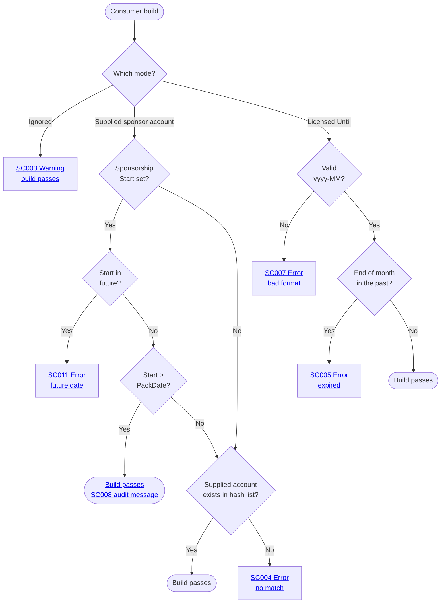

#  SponsorCheck

[](https://ci.appveyor.com/project/SimonCropp/SponsorCheck)
[](https://www.nuget.org/packages/SponsorCheck/)


Build-time sponsorship verification for NuGet packages — nudge consumers of an OSS library to sponsor its author, in the spirit of the [Open Source Maintenance Fee](https://opensourcemaintenancefee.org/). Gentle nudging plus honesty rather than runtime DRM.

OSS authors install `SponsorCheck` as a development dependency in their library project. At pack time, a Bundler MSBuild task fetches the author's sponsor list from one or more configured **sponsorship platforms** (GitHub Sponsors, Open Collective, Polar), hashes each account, and bundles a build-time verifier into the produced NuGet package — *without* adding any runtime dependency to that package.

When consumers reference the produced package, the bundled verifier runs on every build and requires one of three mutually exclusive license-mode metadata declarations per package: a sponsor account that matches the bundled list, a time-bounded private license, or an explicit "ignored" with a build warning.


## OSS author setup

Add `SponsorCheck` as a `PrivateAssets="all"` development dependency on the library project, with one `<Platform>Account` metadatum per supported platform.

<!-- snippet: ThePackage.csproj -->
<a id='snippet-ThePackage.csproj'></a>
```csproj
<Project Sdk="Microsoft.NET.Sdk">
  <PropertyGroup>
    <TargetFramework>netstandard2.0</TargetFramework>
    <PackageId>ThePackage</PackageId>
    <Version>1.0.0</Version>
    <Authors>Acme Corp</Authors>
    <Description>Sample library used by SponsorCheck integration tests.</Description>
    <ManagePackageVersionsCentrally>false</ManagePackageVersionsCentrally>
    <NoWarn>$(NoWarn);NU5128</NoWarn>
  </PropertyGroup>
  <ItemGroup>
    <PackageReference Include="SponsorCheck" Version="$(SponsorCheckVersion)"
                      PrivateAssets="all"
                      GitHubSponsorsAccount="acmecorp"
                      OpenCollectiveAccount="acme-org"
                      PolarAccount="acme" />
  </ItemGroup>
</Project>
```
<sup><a href='/IntegrationTests/Fixtures/_Shared/ThePackage/ThePackage.csproj#L1-L18' title='Snippet source file'>snippet source</a> | <a href='#snippet-ThePackage.csproj' title='Start of snippet'>anchor</a></sup>
<!-- endSnippet -->


### Platforms

At least one `<Platform>Account` must be set. Credentials per platform:


#### [GitHub Sponsors](https://github.com/open-source/sponsors)

 * MSBuild property: `<GitHubToken>`
 * Env var: `GitHubToken` (auto-imported into the MSBuild property of the same name)
 * User-secrets key: `SponsorCheck:GitHubToken`

Required - [classic PAT](https://github.com/settings/tokens/new) with `read:user` (when sponsored as a user) and/or `read:org` (when sponsored as an organization), or a [fine-grained PAT](https://github.com/settings/personal-access-tokens/new) with **Sponsorships: Read-only**. The token must be owned by the sponsored account (or an admin of the sponsored org) — otherwise private sponsors are silently filtered out and the bundled hash list will be incomplete.

Some organizations disable classic-PAT access in their security settings. When sponsored as such an org, a classic PAT will fail with a `FORBIDDEN` error from GitHub at pack time and the bundler emits an actionable message. The fix is to issue a [fine-grained PAT](https://github.com/settings/personal-access-tokens/new) — set **Resource owner** to the sponsored org and grant **Sponsorships: Read-only** under organization permissions.


#### [OpenCollective](https://opencollective.com)

 * MSBuild property: `<OpenCollectiveToken>`
 * Env var: `OpenCollectiveToken` (auto-imported into the MSBuild property of the same name)
 * User-secrets key: `SponsorCheck:OpenCollectiveToken`

Optional - public collectives are queryable anonymously, but anonymous calls hit rate limits on collectives with many backers. Create a [Personal Token](https://opencollective.com/applications) (no scopes required — the token is used for rate-limit headroom, not access).


#### [Polar](https://polar.sh)

 * MSBuild property: `<PolarToken>`
 * Env var: `PolarToken` (auto-imported into the MSBuild property of the same name)
 * User-secrets key: `SponsorCheck:PolarToken`

Required - [organization access token](https://docs.polar.sh/integrate/authentication/personal-access-token) with scopes `subscriptions:read`, `customers:read`, `organizations:read`. The customer scope matters: without it Polar can return null `github_username` / `email` on embedded customer objects, causing the bundler to fall back to opaque `user_id`s that won't match consumer-declared `<PolarSponsorAccount>` values.


### Token expiry

GitHub PATs and Polar API keys both expire. If a CI build suddenly fails with HTTP 401 from a platform, the token has likely expired — rotate it and update the secret. Pick "no expiration" on the GitHub PAT form for set-and-forget; otherwise add the rotation date to a calendar.


### Storing credentials

Precedence: explicit MSBuild property → env var (auto-imported by MSBuild) → user-secrets.


#### Local dev — user-secrets

Recommended for local builds. [`dotnet user-secrets`](https://learn.microsoft.com/aspnet/core/security/app-secrets) stores tokens at `%APPDATA%\Microsoft\UserSecrets\<UserSecretsId>\secrets.json` (Windows) or `~/.microsoft/usersecrets/<id>/secrets.json` (Unix) — outside the repo, so there's no risk of accidentally committing the value. The bundler reads `SponsorCheck:<Platform>Token` keys.

Run from the directory containing the library's `.csproj`, or pass `--project <path>` explicitly — `dotnet user-secrets` resolves the project from the current directory and errors if it finds zero or multiple project files.

```pwsh
# writes <UserSecretsId> into the csproj in cwd
dotnet user-secrets init
dotnet user-secrets set "SponsorCheck:GitHubToken" "ghp_xxx"
dotnet user-secrets set "SponsorCheck:OpenCollectiveToken" "zzz"
dotnet user-secrets set "SponsorCheck:PolarToken" "polar_yyy"
```


#### CI — encrypted env vars

Recommended for CI builds, where there's no per-developer profile to hold a user-secrets file. Encrypt the token in the CI provider's secret store (AppVeyor "secure variable", GitHub Actions secret, Azure DevOps secret variable, etc.) and surface it as an env var named `GitHubToken`, `OpenCollectiveToken`, or `PolarToken`. MSBuild auto-imports env vars as properties, so no extra wiring is needed — the bundler picks them up via the same `<GitHubToken>` / `<OpenCollectiveToken>` / `<PolarToken>` resolution path. Names match the MSBuild property names exactly (case-sensitive on Linux/macOS).


### Multiple packable projects in one repo

For repos that produce multiple NuGet packages, configure once and let MSBuild's normal cascading mechanisms apply:

```xml
<!-- Directory.Packages.props — sponsor accounts in one place -->
<PackageVersion Include="SponsorCheck" Version="0.1.0"
                GitHubSponsorsAccount="acmecorp"
                OpenCollectiveAccount="acme-org"
                PolarAccount="acme" />
```

```xml
<!-- Directory.Build.props — one UserSecretsId shared by every project so they all read the same secrets.json -->
<PropertyGroup>
  <UserSecretsId>acmecorp-monorepo-secrets</UserSecretsId>
</PropertyGroup>
```

Each csproj declares the bare reference:

```xml
<PackageReference Include="SponsorCheck" PrivateAssets="all" />
```

Each project still bundles independently at its own pack time (one platform fetch per packable project).

For testing or offline builds, set `<SponsorListOverride>` to a JSON file path:

<!-- snippet: sponsors-override.json -->
<a id='snippet-sponsors-override.json'></a>
```json
[
  { "platform": "GitHubSponsors", "account": "alice" },
  { "platform": "GitHubSponsors", "account": "bob" },
  { "platform": "OpenCollective", "account": "acme-org" },
  { "platform": "Polar",          "account": "acme" }
]
```
<sup><a href='/IntegrationTests/IntegrationTests/Fixtures/sponsors-override.json#L1-L6' title='Snippet source file'>snippet source</a> | <a href='#snippet-sponsors-override.json' title='Start of snippet'>anchor</a></sup>
<!-- endSnippet -->


## Consumer license modes (per package, mutually exclusive)

Pick exactly one mode per `<PackageReference>` (or set the metadata on the matching `<PackageVersion>` under CPM). The verifier reads metadata from both and merges (agree → use; disagree → [conflicting metadata - SC006](docs/VerifierDiagnosticCodes.md#sc006)).


### Sponsor account match (any platform)

<!-- snippet: Consumer.ValidGitHubSponsor.csproj -->
<a id='snippet-Consumer.ValidGitHubSponsor.csproj'></a>
```csproj
<Project Sdk="Microsoft.NET.Sdk">
  <PropertyGroup>
    <TargetFramework>net10.0</TargetFramework>
  </PropertyGroup>
  <ItemGroup>
    <PackageReference Include="ThePackage" Version="1.0.0"
                      GitHubSponsorAccount="alice" />
  </ItemGroup>
</Project>
```
<sup><a href='/IntegrationTests/Fixtures/Consumer.ValidGitHubSponsor/Consumer.ValidGitHubSponsor.csproj#L1-L9' title='Snippet source file'>snippet source</a> | <a href='#snippet-Consumer.ValidGitHubSponsor.csproj' title='Start of snippet'>anchor</a></sup>
<!-- endSnippet -->

When the package author accepts multiple platforms and the consumer sponsors on one of them, supply the matching `<Platform>SponsorAccount` metadata. Multiple values are allowed — the verifier passes if **any** account matches the bundled list.


#### Recent sponsors: SponsorshipStart

The bundled hash list is frozen at the package's pack date. When sponsorship begins *after* the package was released, the account cannot possibly be in the list. Add `SponsorshipStart="yyyy-MM-dd"` to attest to the start date:

```xml
<PackageReference Include="ThePackage" Version="1.0"
                  GitHubSponsorAccount="carol"
                  SponsorshipStart="2026-04-30" />
```

If `SponsorshipStart` is **after** the package's pack date, the verifier trusts the declaration and emits a [trusted SponsorshipStart - SC008](docs/VerifierDiagnosticCodes.md#sc008) high-priority build message naming the unverified sponsor (audit trail in the consumer's own build log). If `SponsorshipStart` is on or before the pack date (including equal — the boundary is strict), the hash check is enforced as normal: claiming to be a sponsor at release time means the account should already be in the bundled list.

`SponsorshipStart` in the future fails with [future SponsorshipStart - SC011](docs/VerifierDiagnosticCodes.md#sc011). Once the OSS author ships a new version of ThePackage that includes the new sponsor in its hash list **and the consumer upgrades to it**, `SponsorshipStart` can be dropped. If the consumer stays on the older version, the attestation must remain.


#### Sponsorship lifecycle: what happens after sponsorship lapses

The bundled hash list is frozen per package version. The verifier has no notion of "currently sponsoring" — it only checks whether the consumer's account hash was in the list at pack time, or whether the consumer has attested to a `SponsorshipStart` after that pack date. That has three practical consequences when sponsorship lapses:

1. **Already-bundled versions stay buildable forever.** If the consumer's account hash was bundled into v1.1 at the time it was packed, the verifier keeps accepting it for v1.1 builds even after the consumer stops sponsoring. Versions paid for stay paid for; the OSS author has no recall mechanism short of yanking the package.
2. **Newer versions packed after a lapse reject the consumer.** If the author ships v1.2 after the consumer stops, the consumer's hash is not in v1.2's bundled list and a hash-only check fails with [no sponsor match - SC004](docs/VerifierDiagnosticCodes.md#sc004). To upgrade, the consumer must either re-sponsor (so the hash lands in the next pack), switch the package to `SponsorshipLicensedUntil="yyyy-MM"`, or opt out with `SponsorshipLicenseIgnored="true"` (which emits the [license ignored - SC003](docs/VerifierDiagnosticCodes.md#sc003) warning on every build).
3. **`SponsorshipStart` is honor-system but self-expiring.** The verifier cannot tell whether the consumer is currently sponsoring; it only checks that the attested start date is `> PackDate` and `<= today`. While the consumer stays on the package version where the attestation was added, leaving it in after a lapse keeps the build passing — same shape as bullet 1 (paid versions stay paid). On upgrade, the newer `PackDate` overtakes the attested start, the bypass stops firing, and bullet 2 takes over (lapsed sponsors fail with [no sponsor match - SC004](docs/VerifierDiagnosticCodes.md#sc004)). So `SponsorshipStart` doesn't need to be cleaned up proactively — leaving it in place is harmless. The only audit signal while the bypass is active is the [trusted SponsorshipStart - SC008](docs/VerifierDiagnosticCodes.md#sc008) message in the consumer's own build log; the OSS author never sees it.


### Time-bounded private license

<!-- snippet: Consumer.FutureLicense.csproj -->
<a id='snippet-Consumer.FutureLicense.csproj'></a>
```csproj
<Project Sdk="Microsoft.NET.Sdk">
  <PropertyGroup>
    <TargetFramework>net10.0</TargetFramework>
  </PropertyGroup>
  <ItemGroup>
    <PackageReference Include="ThePackage" Version="1.0.0"
                      SponsorshipLicensedUntil="2099-12" />
  </ItemGroup>
</Project>
```
<sup><a href='/IntegrationTests/Fixtures/Consumer.FutureLicense/Consumer.FutureLicense.csproj#L1-L9' title='Snippet source file'>snippet source</a> | <a href='#snippet-Consumer.FutureLicense.csproj' title='Start of snippet'>anchor</a></sup>
<!-- endSnippet -->

For private B2B licensing arrangements outside of the platforms. Format is `yyyy-MM`; the license is valid through the end of that month UTC.


### Explicit ignore (escape hatch)

<!-- snippet: Consumer.IgnoredLicense.csproj -->
<a id='snippet-Consumer.IgnoredLicense.csproj'></a>
```csproj
<Project Sdk="Microsoft.NET.Sdk">
  <PropertyGroup>
    <TargetFramework>net10.0</TargetFramework>
  </PropertyGroup>
  <ItemGroup>
    <PackageReference Include="ThePackage" Version="1.0.0"
                      SponsorshipLicenseIgnored="true" />
  </ItemGroup>
</Project>
```
<sup><a href='/IntegrationTests/Fixtures/Consumer.IgnoredLicense/Consumer.IgnoredLicense.csproj#L1-L9' title='Snippet source file'>snippet source</a> | <a href='#snippet-Consumer.IgnoredLicense.csproj' title='Start of snippet'>anchor</a></sup>
<!-- endSnippet -->

Build passes but emits the [license ignored - SC003](docs/VerifierDiagnosticCodes.md#sc003) warning on every build, flagging that the build is in breach of the package's license.


## Diagnostic codes

- [Verifier diagnostic codes (SC0xx)](docs/VerifierDiagnosticCodes.md) — emitted in consumer projects.
- [Bundler diagnostic codes (SC1xx)](docs/BundlerDiagnosticCodes.md) — emitted at the OSS author's pack time.


## How it works

The bundler runs at the OSS author's pack time (Release config, `IsPackable=true`). It:

1. Reads `<Platform>Account` metadata from the SponsorCheck `PackageReference` / `PackageVersion`.
2. For each enabled platform, calls the platform's API (or reads `SponsorListOverride` if set) to get the list of sponsor accounts.
3. Hashes each as the first 12 hex chars (48 bits) of `SHA256(utf8("{platform-id}:{lowercase(account)}"))`. Platform-id prefix prevents cross-platform spoofing.
4. Writes the sorted, deduped hashes to `build/SponsorCheck.SponsorHashes.txt` and a verifier `.targets` file to `build/<ThePackageId>.targets` inside the produced nupkg, plus the verifier task DLL under `tasks/`.

The verifier runs in consumer projects on every build and:

1. Locates the consumer's `PackageReference` and `PackageVersion` for ThePackage by id.
2. Merges metadata across both. Reads license-mode declarations (`SponsorshipLicenseIgnored`, `SponsorshipLicensedUntil`, `<Platform>SponsorAccount`).
3. Applies the appropriate decision: ignored (warn), sponsor (check hash list), license (check expiry), or fail with the relevant SC code.




## Hashing — what it protects

The hash is **light obfuscation, not real privacy.** Anyone with a wordlist of candidate usernames can reverse-engineer the published hashes by recomputing `SHA256("{platform-id}:{lowercase(login)}")` for each candidate and truncating to 12 hex chars. The hash isn't a security boundary either — `SponsorshipLicenseIgnored="true"` is the documented bypass, so anyone wanting to free-ride doesn't need to forge a match.

What hashing actually buys:

1. **Private GitHub sponsors don't ship as plaintext.** GitHub Sponsors lets sponsors opt to be private. The bundler still includes them (the token-owner can see them via the API), and the resulting file lands in every consumer's `~/.nuget/packages/<id>/<ver>/build/` after restore. Hashing means a private sponsor's username is not grep-able across every consumer's disk — an attacker has to specifically guess it and recompute the hash to confirm. Plaintext would effectively dox every private sponsor to every consumer.
2. **Friction against casual scraping.** A flat list of usernames in a published nupkg is a free dataset for anyone running `nuget restore` on public CI. Hashing doesn't stop a determined deanonymizer but does stop incidental harvesting.

If a sponsor needs guarantees stronger than "annoying to reverse" — e.g. they're sponsoring under a pseudonym they're trying to keep separate from their GitHub identity — the OSS author should ask them up front and either skip the bundling entirely or accept the risk of targeted username guesses. The hash is a speed bump, not a wall.

Hash length is truncated to 48 bits (12 hex chars) because the only correctness requirement is "accidental collisions are implausible" — a non-sponsor's hash falsely matching the bundled list is ≈ 1 in tens of billions even at 100k sponsors. Preimage resistance is unnecessary given `SponsorshipLicenseIgnored`.


## Project layout

- `src/SponsorCheck` — the multi-targeted (netstandard2.0;net472) MSBuild task assembly plus the package's bundler `.targets` and embedded verifier template; produces the `SponsorCheck` nupkg
- `src/SponsorCheck.Tests` — TUnit + Verify unit tests for pure helpers and tasks
- `IntegrationTests/IntegrationTests` — end-to-end tests that pack ThePackage with the just-built SponsorCheck and build consumer fixtures (C#, F#, VB) against it


## Build & test

```pwsh
dotnet build src --configuration Release
dotnet run  --project src/SponsorCheck.Tests --configuration Release --no-build
dotnet build IntegrationTests --configuration Release
dotnet run  --project IntegrationTests/IntegrationTests --configuration Release --no-build
```


## Icon

https://thenounproject.com/icon/optical-illusion-344030/
