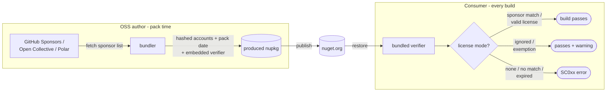

#  SponsorCheck

[](https://ci.appveyor.com/project/SimonCropp/SponsorCheck)
[](https://www.nuget.org/packages/SponsorCheck/)


Build-time sponsorship verification for NuGet packages - nudge consumers of an OSS library to sponsor its author, in the spirit of the [Open Source Maintenance Fee](https://opensourcemaintenancefee.org/). Gentle nudging plus honesty rather than runtime DRM.

An OSS author installs SponsorCheck as a development dependency. At pack time it fetches the author's sponsor list from the configured **sponsorship platforms** (GitHub Sponsors, Open Collective, Polar), hashes each account, and bundles a build-time verifier into the produced NuGet package - *without* adding any runtime dependency to that package. When a consumer builds against that package, the verifier requires one of three license modes: a sponsor account that matches the bundled list, a time-bounded private license, or an explicit "ignored" with a build warning.

Pick the path that applies:

- **A build is asking for sponsorship metadata** (an `SC0xx` error or warning) - [Consumer usage](#consumer-usage) below; full detail in the [consumer guide](docs/ConsumerUsage.md).
- **Considering SponsorCheck for a library** - [OSS author setup](#oss-author-setup) below; full detail in the [author guide](docs/AuthorSetup.md).
- **Prefer answering a few questions** - the [setup wizard](https://simoncropp.github.io/SponsorCheck/) generates tailored, copy-pasteable configuration for either role; given a package id it inspects the published nupkg and pre-answers most of them.


## Why this approach

OSS sustainability mechanisms sit on a spectrum:

- **No checking** - link a sponsor page in the readme and hope. Zero cost on both sides, and near-zero conversion: the ask is seen once at install time (if at all), then forgotten. Dependabot/Renovate bumps and AI coding agents never read it.
- **Full commercial licensing** - per-consumer license keys, billing, rotation, support. Strong enforcement, but the maintainer now operates a commercial product alongside the OSS project, and consumers manage secrets in CI. For a side-project the overhead can exceed the revenue captured.
- **SponsorCheck** - the author keeps using GitHub Sponsors / Open Collective / Polar, and each pack bundles a hashed sponsor list plus a build-time verifier. Sponsoring consumers declare one metadata attribute; everyone else sees a documented `SC0xx` error or warning inside the build loop, on every build, where it cannot decay. The platform still does all the signup, billing, and rotation - no license keys are ever issued.

The trade for staying frictionless is honesty: hashing is not a security boundary, and `SponsorshipLicenseIgnored="true"` is the documented bypass. The intent is to convert the inattentive majority - teams that would happily sponsor if the ask ever reached them - not to extract revenue from adversaries. For the scenario-by-scenario argument (discovery, actor types, escape hatches, and the trace each one leaves), see [Why build-time verification](docs/WhyBuildTimeVerification.md).


## Consumer usage

A package referenced by the build bundles the SponsorCheck verifier, and the build now requires a license mode. The failing message ([SC001](docs/VerifierDiagnosticCodes.md#sc001) and friends) already contains a copy-pasteable fix pre-filled with the package id, version, and the file to edit - start there. The modes are mutually exclusive; pick exactly one:

| Situation | Metadata to add |
| --- | --- |
| Sponsoring the author (or about to) | `GitHubSponsorAccount="<account>"` - or `OpenCollectiveSponsorAccount` / `PolarSponsorAccount`. Add `SponsorshipPrivateUntil="yyyy-MM"` when the sponsorship is private or incognito, `SponsorshipStart="yyyy-MM-dd"` when it began after this version was packed |
| Private licensing arrangement with the author | `SponsorshipLicensedUntil="yyyy-MM"` (at most 1 year out) |
| An exemption the publisher defined (consulting client, small business, ...) | `SponsorshipExemption="<name>"` - plus `SponsorshipExemptionUntil="yyyy-MM"` when the publisher time-bounds it |
| Proceeding unlicensed | `SponsorshipLicenseIgnored="true"` - passes, with a breach-of-license warning on every build |

For example:

<!-- snippet: Consumer.ValidGitHubSponsor.csproj -->
<a id='snippet-Consumer.ValidGitHubSponsor.csproj'></a>
```csproj
<Project Sdk="Microsoft.NET.Sdk">
  <PropertyGroup>
    <TargetFramework>net10.0</TargetFramework>
  </PropertyGroup>
  <ItemGroup>
    <PackageReference
      Include="ThePackage"
      Version="1.0.0"
      GitHubSponsorAccount="alice" />
  </ItemGroup>
</Project>
```
<sup><a href='/IntegrationTests/Fixtures/Consumer.ValidGitHubSponsor/Consumer.ValidGitHubSponsor.csproj#L1-L11' title='Snippet source file'>snippet source</a> | <a href='#snippet-Consumer.ValidGitHubSponsor.csproj' title='Start of snippet'>anchor</a></sup>
<!-- endSnippet -->

Where the metadata lives:

- **Plain projects** - on the `<PackageReference>` in the consuming csproj (as above).
- **Central Package Management** - on the matching `<PackageVersion>` in `Directory.Packages.props`.
- **Owner mode** (the author opted the package in; the error message says so) - as a global MSBuild property named `{owner}_GitHubSponsorAccount` etc., set once to cover every package from that owner. See [Owner mode](docs/ConsumerUsage.md#owner-mode).

Started sponsoring after the package version was released? The bundled list is frozen at pack time and cannot contain the account yet - add `SponsorshipStart="yyyy-MM-dd"` alongside the sponsor account. See [Recent sponsors](docs/ConsumerUsage.md#recent-sponsors-sponsorshipstart).

Sponsoring privately (private on GitHub Sponsors, incognito on Open Collective)? Those sponsorships are deliberately never bundled, so the hash list cannot contain the account at all - add `SponsorshipPrivateUntil="yyyy-MM"` alongside the sponsor account. See [Private and incognito sponsors](docs/ConsumerUsage.md#private-and-incognito-sponsors).

The **[consumer guide](docs/ConsumerUsage.md)** covers the rest: sponsoring across multiple platforms, [what happens when sponsorship lapses](docs/ConsumerUsage.md#sponsorship-lifecycle-what-happens-after-sponsorship-lapses), [publisher-defined exemptions](docs/ConsumerUsage.md#publisher-defined-exemptions), [owner mode](docs/ConsumerUsage.md#owner-mode) and [migrating between modes](docs/ConsumerUsage.md#migrating-to-or-from-owner-mode). Every diagnostic is documented in [Verifier diagnostic codes (SC0xx)](docs/VerifierDiagnosticCodes.md).


## OSS author setup

Add `SponsorCheck` as a `PrivateAssets="all"` development dependency on the library project, with one `<Platform>Account` metadatum per supported platform:

<!-- snippet: ThePackage.csproj -->
<a id='snippet-ThePackage.csproj'></a>
```csproj
<Project Sdk="Microsoft.NET.Sdk">
  <PropertyGroup>
    <TargetFramework>netstandard2.0</TargetFramework>
  </PropertyGroup>
  <ItemGroup>
    <PackageReference Include="SponsorCheck" Version="$(SponsorCheckVersion)"
                      PrivateAssets="all"
                      GitHubSponsorsAccount="acmecorp"
                      OpenCollectiveAccount="acme-org"
                      PolarAccount="acme" />
  </ItemGroup>
</Project>
```
<sup><a href='/IntegrationTests/Fixtures/_Shared/ThePackage/ThePackage.csproj#L1-L12' title='Snippet source file'>snippet source</a> | <a href='#snippet-ThePackage.csproj' title='Start of snippet'>anchor</a></sup>
<!-- endSnippet -->

Supply an API credential for each platform that needs one:

| Platform | Account metadata | Credential |
| --- | --- | --- |
| [GitHub Sponsors](https://github.com/open-source/sponsors) | `GitHubSponsorsAccount` | `GitHubToken` - required; classic PAT with `read:user` (plus `read:org` for orgs) |
| [Open Collective](https://opencollective.com) | `OpenCollectiveAccount` | `OpenCollectiveToken` - optional; raises rate limits |
| [Polar](https://polar.sh) | `PolarAccount` | `PolarToken` - required; organization access token |

Locally, store tokens with [user-secrets](docs/AuthorSetup.md#local-dev--user-secrets); on CI, expose each encrypted secret as an env var matching the property name (`GitHubToken` - conventional names like `GITHUB_TOKEN` won't auto-flow):

```pwsh
dotnet user-secrets init
dotnet user-secrets set "SponsorCheck:GitHubToken" "ghp_xxx"
```

That's the whole setup - pack as normal (Release build) and the produced nupkg carries the hashed sponsor list and the embedded verifier. The **[author guide](docs/AuthorSetup.md)** covers the rest:

- [Platforms](docs/AuthorSetup.md#platforms) - token scopes, one-time sponsors, orgs that block classic PATs
- [Storing credentials](docs/AuthorSetup.md#storing-credentials) - user-secrets, CI secret stores, and [pull request builds](docs/AuthorSetup.md#pull-request-builds) (bundling is skipped on PRs)
- [Multiple packable projects in one repo](docs/AuthorSetup.md#multiple-packable-projects-in-one-repo)
- [Owner mode](docs/AuthorSetup.md#owner-mode) - one sponsorship config covering a whole family of packages
- [Checking transitive references](docs/AuthorSetup.md#checking-transitive-references)
- [Packages that ship their own MSBuild targets](docs/AuthorSetup.md#packages-that-ship-their-own-msbuild-targets)
- [Tuning verifier severity and message text](docs/AuthorSetup.md#tuning-verifier-severity-and-message-text) - soften the default errors, or reword them
- [Defining exemptions](docs/AuthorSetup.md#defining-exemptions) - named carve-outs for consumers who legitimately don't need to sponsor, optionally [time-bounded](docs/AuthorSetup.md#time-bounding-an-exemption) so a claim that stops applying fails the build instead of lingering
- [Custom sponsor landing URL](docs/AuthorSetup.md#custom-sponsor-landing-url)
- [Sponsor list override](docs/AuthorSetup.md#sponsor-list-override-testing--offline-builds) - testing and offline builds

Pack-time diagnostics are documented in [Bundler diagnostic codes (SC1xx)](docs/BundlerDiagnosticCodes.md).


## How it works



At the author's pack time, the **bundler** fetches the sponsor accounts from each configured platform and writes them into the produced nupkg as truncated hashes, alongside the pack date, the author's platform accounts (used to render sponsor URLs in diagnostics), a generated verifier targets file, and the verifier task DLL. [What gets bundled](docs/AuthorSetup.md#what-gets-bundled) has the file-by-file detail.

On every consumer build - in every configuration - the **verifier** reads the consumer's declared license mode and passes, warns, or fails with an `SC0xx` code. The full decision tree is charted in [How verification works](docs/ConsumerUsage.md#how-verification-works).

Accounts are hashed (first 12 hex chars of `SHA256("{platform-id}:{lowercase(account)}")`) so the sponsor list isn't republished in plaintext on every consumer's disk - deliberately light obfuscation, not a security boundary. See [Hashing - what it protects](docs/AuthorSetup.md#hashing--what-it-protects). Sponsors who are private on GitHub Sponsors, or incognito on Open Collective, are [never bundled at all](docs/AuthorSetup.md#private-and-incognito-sponsors) and verify with `SponsorshipPrivateUntil="yyyy-MM"` instead.


## Contributing

Project layout and build/test instructions: [contributing.md](contributing.md).


## Icon

https://thenounproject.com/icon/optical-illusion-344030/
